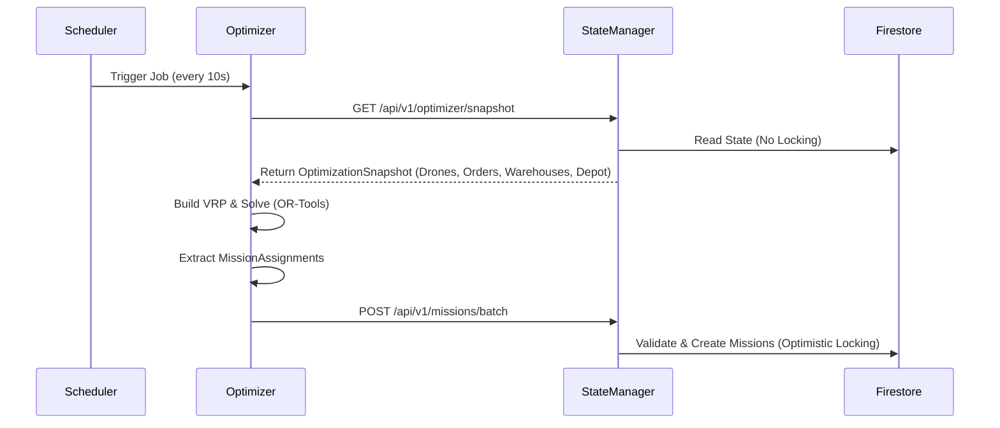

# Implementation Plan: Multi-Trip VRPTW with Battery & Time Windows

This plan details the transformation of the DroneFleet Optimizer from a simple 1-to-1 assignment system to a complex Vehicle Routing Problem (VRP) solver with multiple constraints.

## Architecture & Data Flow

## Phase 1: Shared Models Update (Java & Python)

Update shared schemas to support new VRP requirements.

### 1.1 Java Shared Models (`shared/java/.../models/`)

- **[Drone.java](shared/java/src/main/java/com/dronefleet/shared/models/Drone.java)**: Add `batteryCapacityMah`, `consumptionPerKm`, `maxFlightTimeMinutes`. Add `canCompleteRoute()`.
- **[Order.java](shared/java/src/main/java/com/dronefleet/shared/models/Order.java)**: Add `productType`, `maxDeliveryTimeMinutes`, `priority` (Enum). Add `getDeliveryDeadline()`.
- **[Warehouse.java](shared/java/src/main/java/com/dronefleet/shared/models/Warehouse.java)**: Add `canFulfillOrder()` method.
- **[Mission.java](shared/java/src/main/java/com/dronefleet/shared/models/Mission.java)**: Refactor `route` to `List<Waypoint>` and support `orderIds` (List).
- **[Depot.java](shared/java/src/main/java/com/dronefleet/shared/models/Depot.java)**: Create new class for Home Depot entity.
- **[OptimizationSnapshot.java](shared/java/src/main/java/com/dronefleet/shared/models/OptimizationSnapshot.java)**: Add `Depot` and `warehouses` list.

### 1.2 Python Shared Models (`shared/python/.../models/`)

- **[drone.py](shared/python/src/dronefleet_shared/models/drone.py)**: Ensure alignment with Java model.
- **[protocol.py](shared/python/src/dronefleet_shared/models/protocol.py)**: Add `WaypointType` enum.

## Phase 2: State Manager Refactoring (Java)

Implement logic for snapshot retrieval and safe mission assignment.

### 2.1 Domain & Ports (`services/state_manager/...`)

- **[OptimizationSnapshotService.java](services/state_manager/src/main/java/com/dronefleet/statemanager/domain/service/OptimizationSnapshotService.java)**:
  - Implement `GetOptimizationSnapshotUseCase`.
  - Retrieve IDLE drones, PENDING orders, Warehouses, and Depot.
  - **Crucial**: Do NOT change status to RESERVED.
- **[MissionCreationService.java](services/state_manager/src/main/java/com/dronefleet/statemanager/domain/service/MissionCreationService.java)**:
  - Validate Drone is still IDLE.
  - Validate Orders are still PENDING.
  - Create Mission with multi-waypoints.
  - Use `StateTransactionPort` for atomic updates.

### 2.2 Infrastructure

- **[OptimizerController.java](services/state_manager/src/main/java/com/dronefleet/statemanager/infrastructure/adapter/in/rest/OptimizerController.java)**: Create endpoint for snapshot retrieval.
- **[FirestoreRepositories](services/state_manager/src/main/java/com/dronefleet/statemanager/infrastructure/adapter/out/persistence/firestore/)**: Implement `DepotRepository`.

## Phase 3: Optimizer Implementation (Python)

Implement the VRP solver with OR-Tools.

### 3.1 Models (`services/path_optimizer/.../models/`)

- **[snapshot.py](services/path_optimizer/src/path_optimizer/models/snapshot.py)**: Update `DroneSnapshot`, `OrderSnapshot` (add deadline), `OptimizationSnapshot`.
- **[decision.py](services/path_optimizer/src/path_optimizer/models/decision.py)**: Update `MissionAssignment` to support `list[Waypoint]` and `list[order_id]`.

### 3.2 Core Logic (`services/path_optimizer/.../services/`)

- **[builder.py](services/path_optimizer/src/path_optimizer/services/builder.py)**:
  - Build `VRPProblem`.
  - Map multiple warehouses as pickup options for each order.
  - Calculate Time Windows based on Order priority.
- **[solver.py](services/path_optimizer/src/path_optimizer/services/solver.py)**:
  - Add **Time Dimension** (soft/hard windows).
  - Add **Battery Dimension** (consumption per distance, min return charge).
  - Configure `PARALLEL_CHEAPEST_INSERTION` and `GUIDED_LOCAL_SEARCH`.
- **[extractor.py](services/path_optimizer/src/path_optimizer/services/extractor.py)**:
  - Parse OR-Tools solution.
  - Construct `MissionAssignment` with explicit waypoints (Start -> Pickup -> Delivery -> ... -> End).

## Phase 4: Integration & Verification

- **API Integration**: Ensure Optimizer calls State Manager API correctly.
- **End-to-End Test**:
  1. Lunch the docker-compose
  2. Inject Orders and some Drones via Simulator.
  3. Trigger Optimizer.
  4. Verify Mission created in Firestore has correct multi-step route.

## Phase 5: Clear Explaination Step-by-Step

- Create a new Markdown file complete_flux.md in .cursor/rules.personal/ folder
- Explain inside all the logical step that append here with the optimizer on every file, from the lunch of the optimizer to write of the mission on Firestore. the goal is to be a claer and very detailed documention that explain all the code logic of the optimizer and the write of the mission by the state manager to Firestore, by assuming Telemetry and Orders Data are fetched by the state manager to FireStore with the 2 topics Telemetry topic and Orders topic.
