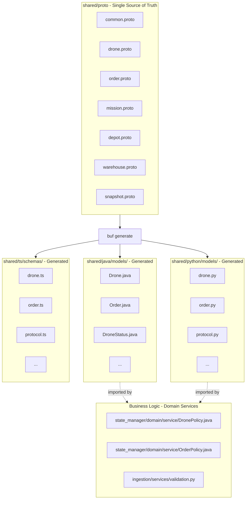
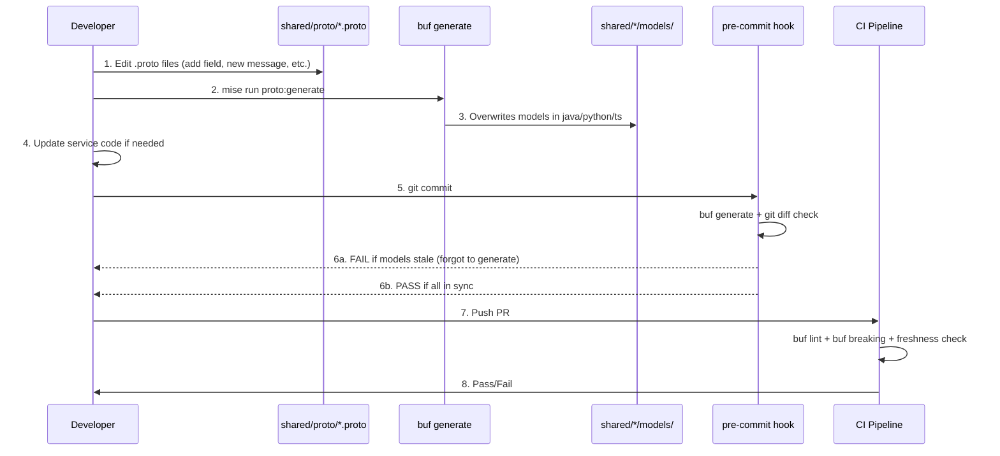

# Protobuf Schema Synchronization for DroneFleet Monorepo

## Context and Problem

Currently, ~10 shared data models (Drone, Order, Mission, Depot, Warehouse, Position, enums, etc.) are manually maintained in three languages:

- Python/Pydantic in [shared/python/src/dronefleet_shared/models/](shared/python/src/dronefleet_shared/models/)
- Java/Lombok in [shared/java/src/main/java/com/dronefleet/shared/models/](shared/java/src/main/java/com/dronefleet/shared/models/)
- TypeScript/Zod in [shared/ts/src/schemas/](shared/ts/src/schemas/)

The TypeScript models are already drifting (missing Order, Mission, Depot, Warehouse, Snapshot). Some models contain business logic that should live in domain services, not in shared data structures.

## Revised Architecture: Direct Generation, No Duplication

Use **Buf** (modern protobuf toolchain) with `.proto` files as the single source of truth. `buf generate` writes **directly into the existing `models/` and `schemas/` directories**, replacing hand-written models entirely. No `generated/` subdirectory, no mapper layer, no duplication.

Business logic currently embedded in shared models is migrated to domain service classes where it architecturally belongs (hexagonal architecture: models are pure data, logic lives in services).




## Directory Structure

```
shared/
  proto/                                        # NEW - Single source of truth
    buf.yaml                                    # Buf module configuration
    buf.gen.yaml                                # Code generation rules (outputs to models/)
    dronefleet/v1/                              # Versioned proto package
      common.proto                              # Position, all enums
      drone.proto                               # Drone, DroneTelemetry
      order.proto                               # Order
      mission.proto                             # Mission, Waypoint, MissionAssignment
      depot.proto                               # Depot
      warehouse.proto                           # Warehouse
      snapshot.proto                            # OptimizationSnapshot
  java/
    build.gradle                                # MODIFY - add protobuf runtime dependency
    src/main/java/com/dronefleet/shared/
      models/                                   # OVERWRITTEN by buf generate (pure data)
  python/
    pyproject.toml                              # MODIFY - add betterproto dependency
    src/dronefleet_shared/
      models/                                   # OVERWRITTEN by buf generate (pure data)
  ts/
    package.json                                # MODIFY - add ts-proto dev dependency
    src/
      schemas/                                  # OVERWRITTEN by buf generate (pure data)
```

## Phase 0: Business Logic Migration (Before Proto)

Before replacing models with generated code, business logic must move to domain services. This is architecturally correct regardless of Protobuf -- shared models should be pure data structures.

### Java: Business Logic to Migrate

All methods below move from `shared/java/.../models/` to `services/state_manager/.../domain/service/`.

**New file: `DronePolicy.java**` in [services/state_manager/src/main/java/com/dronefleet/statemanager/domain/service/](services/state_manager/src/main/java/com/dronefleet/statemanager/domain/service/)


| Source File        | Method                             | Destination                                                                   |
| ------------------ | ---------------------------------- | ----------------------------------------------------------------------------- |
| `Drone.java`       | `isAvailable()`                    | `DronePolicy.isAvailable(Drone)`                                              |
| `Drone.java`       | `canCompleteRoute(double, double)` | `DronePolicy.canCompleteRoute(Drone, double, double)`                         |
| `Drone.java`       | `updateTelemetry(...)`             | `DronePolicy.applyTelemetryUpdate(Drone, DroneTelemetry)` (returns new Drone) |
| `DroneStatus.java` | `parseStatus(String)`              | `DronePolicy.parseStatus(String)`                                             |
| `DroneStatus.java` | `isOperational()`                  | `DronePolicy.isOperational(DroneStatus)`                                      |
| `DroneStatus.java` | `requiresAttention()`              | `DronePolicy.requiresAttention(DroneStatus)`                                  |
| `DroneStatus.java` | `canAcceptMission()`               | `DronePolicy.canAcceptMission(DroneStatus)`                                   |


**New file: `OrderPolicy.java**`


| Source File  | Method                  | Destination                              |
| ------------ | ----------------------- | ---------------------------------------- |
| `Order.java` | `getDeliveryDeadline()` | `OrderPolicy.getDeliveryDeadline(Order)` |
| `Order.java` | `isOverdue(Instant)`    | `OrderPolicy.isOverdue(Order, Instant)`  |


**New file: `WarehousePolicy.java**`


| Source File      | Method                   | Destination                                         |
| ---------------- | ------------------------ | --------------------------------------------------- |
| `Warehouse.java` | `canFulfillOrder(Order)` | `WarehousePolicy.canFulfillOrder(Warehouse, Order)` |


**Position validation** (`Position.isValid()`) moves to a validation utility or is handled at the adapter layer since proto already constrains the type to `double`.

### Python: Business Logic to Migrate

Python shared models have very little business logic. The main items:


| Source File    | Element                                  | Destination                                                         |
| -------------- | ---------------------------------------- | ------------------------------------------------------------------- |
| `order.py`     | `max_delivery_time_minutes` property     | Utility function in `path_optimizer` or inline in optimizer builder |
| `telemetry.py` | `Field(ge=-90, le=90)` on Position       | FastAPI endpoint validation or service-level check                  |
| `telemetry.py` | `Config.json_schema_extra`               | FastAPI endpoint `response_model` examples                          |
| `order.py`     | `Field(default_factory=datetime.utcnow)` | Service-level default assignment                                    |
| `drone.py`     | `Config.json_schema_extra`               | FastAPI endpoint examples                                           |


### Update Service References

After migration, update all call sites in [services/state_manager/](services/state_manager/src/main/java/com/dronefleet/statemanager/) that call `drone.isAvailable()`, `order.getDeliveryDeadline()`, etc. to use the new policy classes.

Key files to update:

- [MissionAssignmentPolicy.java](services/state_manager/src/main/java/com/dronefleet/statemanager/domain/service/MissionAssignmentPolicy.java) -- already checks `drone.getStatus() != DroneStatus.IDLE` directly
- [FirestoreStateTransactionAdapter.java](services/state_manager/src/main/java/com/dronefleet/statemanager/infrastructure/adapter/out/persistence/firestore/FirestoreStateTransactionAdapter.java) -- calls `drone.updateTelemetry()`

## Phase 1: Proto Schema Definition

### Tooling

- **Buf CLI** (`buf`): Modern protobuf toolchain. Linting, formatting, breaking change detection, code generation. Replaces raw `protoc`.
- **Python plugin**: `danielgtaylor/python-betterproto` -- generates clean Python dataclasses (close to idiomatic Python, compatible with FastAPI).
- **Java plugin**: `protocolbuffers/java` -- standard protobuf-java. Generates immutable message classes with builder pattern.
- **TypeScript plugin**: `stephenh/ts-proto` -- generates clean TypeScript interfaces with JSON encode/decode helpers.

### Proto Files

Example for `common.proto`:

```protobuf
// shared/proto/dronefleet/v1/common.proto
syntax = "proto3";
package dronefleet.v1;

message Position {
  double lat = 1;
  double lon = 2;
}

enum DroneStatus {
  DRONE_STATUS_UNSPECIFIED = 0;
  DRONE_STATUS_IDLE = 1;
  DRONE_STATUS_RESERVED = 2;
  DRONE_STATUS_MOVING = 3;
  DRONE_STATUS_DELIVERING = 4;
  DRONE_STATUS_CHARGING = 5;
  DRONE_STATUS_MAINTENANCE = 6;
  DRONE_STATUS_PROBLEM = 7;
  DRONE_STATUS_EMERGENCY = 8;
  DRONE_STATUS_UNKNOWN = 9;
}

enum OrderStatus {
  ORDER_STATUS_UNSPECIFIED = 0;
  ORDER_STATUS_PENDING = 1;
  ORDER_STATUS_SOLVING = 2;
  ORDER_STATUS_ASSIGNED = 3;
  ORDER_STATUS_IN_DELIVERY = 4;
  ORDER_STATUS_DELIVERED = 5;
  ORDER_STATUS_CANCELLED = 6;
}

enum OrderPriority {
  ORDER_PRIORITY_UNSPECIFIED = 0;
  ORDER_PRIORITY_STANDARD = 1;
  ORDER_PRIORITY_HIGH = 2;
  ORDER_PRIORITY_CRITICAL = 3;
}

enum ProductType {
  PRODUCT_TYPE_UNSPECIFIED = 0;
  PRODUCT_TYPE_MEDICINE = 1;
  PRODUCT_TYPE_VACCINE = 2;
  PRODUCT_TYPE_BLOOD = 3;
  PRODUCT_TYPE_ORGAN = 4;
  PRODUCT_TYPE_MEDICAL_DEVICE = 5;
}

enum ActionType {
  ACTION_TYPE_UNSPECIFIED = 0;
  ACTION_TYPE_FLY_TO = 1;
  ACTION_TYPE_PICKUP = 2;
  ACTION_TYPE_DROPOFF = 3;
  ACTION_TYPE_CHARGE = 4;
}

enum WaypointType {
  WAYPOINT_TYPE_UNSPECIFIED = 0;
  WAYPOINT_TYPE_DEPOT_START = 1;
  WAYPOINT_TYPE_WAREHOUSE_PICKUP = 2;
  WAYPOINT_TYPE_HOSPITAL_DELIVERY = 3;
  WAYPOINT_TYPE_DEPOT_RETURN = 4;
}
```

Example for `drone.proto`:

```protobuf
// shared/proto/dronefleet/v1/drone.proto
syntax = "proto3";
package dronefleet.v1;

import "google/protobuf/timestamp.proto";
import "dronefleet/v1/common.proto";

message Drone {
  string id = 1;
  Position position = 2;
  double battery_percentage = 3;
  double speed_kmh = 4;
  DroneStatus status = 5;
  string current_mission_id = 6;
  google.protobuf.Timestamp last_update = 7;
  string solving_session_id = 8;
  string home_depot_id = 9;
  int32 battery_capacity_mah = 10;
  double consumption_per_km = 11;
  int32 max_flight_time_minutes = 12;
}

message DroneTelemetry {
  string drone_id = 1;
  google.protobuf.Timestamp timestamp = 2;
  Position position = 3;
  double battery_percentage = 4;
  double speed_kmh = 5;
  DroneStatus status = 6;
  string current_mission_id = 7;
}
```

## Phase 2: Buf Configuration

`**shared/proto/buf.yaml`:**

```yaml
version: v2
modules:
  - path: .
lint:
  use:
    - STANDARD
breaking:
  use:
    - FILE
```

`**shared/proto/buf.gen.yaml`:**

```yaml
version: v2
managed:
  enabled: true
  override:
    - file_option: java_package
      value: com.dronefleet.shared.models
    - file_option: java_multiple_files
      value: true
plugins:
  # Java: generates into shared/java models package directly
  - remote: buf.build/protocolbuffers/java
    out: ../java/src/main/java

  # Python: generates betterproto dataclasses into models/ directly
  - remote: buf.build/danielgtaylor/python-betterproto
    out: ../python/src/dronefleet_shared/models

  # TypeScript: generates interfaces into schemas/ directly
  - remote: buf.build/community/stephenh-ts-proto
    out: ../ts/src/schemas
    opt:
      - esModuleInterop=true
      - outputEncodeMethods=false
      - outputJsonMethods=true
      - snakeToCamel=false
```

Key difference from the previous plan: `java_package` is `com.dronefleet.shared.models` (not `.generated`), and all output paths point directly to the existing `models/` and `schemas/` directories.

## Phase 3: mise Integration

Add to [mise.toml](mise.toml):

```toml
[tools]
buf = "latest"

[tasks."proto:lint"]
description = "Lint protobuf definitions"
run = "buf lint"
dir = "shared/proto"

[tasks."proto:format"]
description = "Format protobuf files"
run = "buf format -w"
dir = "shared/proto"

[tasks."proto:generate"]
description = "Generate model code from proto definitions into shared/*/models/"
run = "buf generate"
dir = "shared/proto"

[tasks."proto:breaking"]
description = "Check for breaking schema changes against main branch"
run = "buf breaking --against '../../.git#branch=main,subdir=shared/proto'"
dir = "shared/proto"

[tasks."proto:check"]
description = "Full proto validation (lint + breaking + generate + verify)"
depends = ["proto:lint", "proto:breaking", "proto:generate"]
```

## Phase 4: Pre-commit Hook

Add a local hook to [.pre-commit-config.yaml](.pre-commit-config.yaml) that runs `buf generate` and fails if generated models are out of sync with proto definitions. This catches drift before any commit reaches CI.

```yaml
  # Protobuf schema sync check
  - repo: local
    hooks:
      - id: proto-sync-check
        name: Check proto-generated models are up to date
        entry: bash -c 'cd shared/proto && buf generate && git diff --exit-code -- ../java/src/main/java/com/dronefleet/shared/models/ ../python/src/dronefleet_shared/models/ ../ts/src/schemas/'
        language: system
        files: '\.(proto|java|py|ts)$'
        pass_filenames: false
```

This means: if a developer edits a `.proto` file but forgets to run `mise run proto:generate`, the pre-commit hook regenerates and checks for differences. If the generated output differs from what is committed, the hook fails with a clear diff showing what is out of sync. The developer then simply runs `mise run proto:generate` and stages the result.

Conversely, if someone edits a model file directly (e.g., `Drone.java`) without going through proto, the next `buf generate` will overwrite their change, and the pre-commit hook will flag the mismatch. This enforces proto-first discipline.

## Phase 5: CI/CD Integration

Create `.github/workflows/ci-proto.yml`:

```yaml
name: CI - Proto Schema Validation

on:
  pull_request:
    paths:
      - "shared/**"
  push:
    branches: [main, develop]
    paths:
      - "shared/**"

jobs:
  proto-check:
    runs-on: ubuntu-latest
    steps:
      - uses: actions/checkout@v4

      - uses: bufbuild/buf-setup-action@v1

      - name: Lint proto definitions
        uses: bufbuild/buf-lint-action@v1
        with:
          input: shared/proto

      - name: Check for breaking changes
        uses: bufbuild/buf-breaking-action@v1
        with:
          input: shared/proto
          against: "https://github.com/${{ github.repository }}.git#branch=main,subdir=shared/proto"

      - name: Verify generated code is up to date
        working-directory: shared/proto
        run: |
          buf generate
          if ! git diff --exit-code -- \
            ../java/src/main/java/com/dronefleet/shared/models/ \
            ../python/src/dronefleet_shared/models/ \
            ../ts/src/schemas/; then
            echo "ERROR: Generated models are out of date."
            echo "Run 'mise run proto:generate' and commit the result."
            exit 1
          fi
```

## Impact on Consuming Services

### Java (state_manager)

Proto-java generates **immutable message classes** with a builder pattern. This changes how models are constructed and modified throughout the state_manager service.

**Before (Lombok):**

```java
Drone drone = Drone.builder().id("D-01").status(DroneStatus.IDLE).build();
drone.setStatus(DroneStatus.MOVING);  // mutable setter
```

**After (proto-java):**

```java
Drone drone = Drone.newBuilder().setId("D-01").setStatus(DroneStatus.IDLE).build();
Drone updated = drone.toBuilder().setStatus(DroneStatus.MOVING).build();  // immutable
```

Files requiring updates in state_manager:

- [FirestoreStateTransactionAdapter.java](services/state_manager/src/main/java/com/dronefleet/statemanager/infrastructure/adapter/out/persistence/firestore/FirestoreStateTransactionAdapter.java) -- Drone/Order construction
- [FirestoreMapper.java](services/state_manager/src/main/java/com/dronefleet/statemanager/infrastructure/adapter/out/persistence/firestore/FirestoreMapper.java) -- mapping to/from Firestore documents
- [MissionAssignmentPolicy.java](services/state_manager/src/main/java/com/dronefleet/statemanager/domain/service/MissionAssignmentPolicy.java) -- drone/order status updates
- [DecisionListener.java](services/state_manager/src/main/java/com/dronefleet/statemanager/infrastructure/adapter/in/messaging/pubsub/DecisionListener.java) -- DTO construction
- [OrderListener.java](services/state_manager/src/main/java/com/dronefleet/statemanager/infrastructure/adapter/in/messaging/pubsub/OrderListener.java) -- Order construction

The `shared/java/build.gradle` must add the protobuf runtime dependency:

```gradle
dependencies {
    api 'com.google.protobuf:protobuf-java:4.29.3'
}
```

### Python (ingestion, path_optimizer)

`betterproto` generates Python dataclasses (not Pydantic). This is a lighter representation.

**Before (Pydantic):**

```python
telemetry = DroneTelemetry(**data)  # automatic validation
payload = telemetry.model_dump(mode="json")
```

**After (betterproto):**

```python
telemetry = DroneTelemetry(**data)  # dataclass construction
payload = telemetry.to_dict()  # betterproto serialization
```

FastAPI natively supports dataclasses as request/response models, so endpoints continue to work. Validation constraints (`ge=-90`, `le=90`) that were in Pydantic `Field` definitions move to explicit checks in service code or FastAPI `Query`/`Body` validators.

Files requiring updates:

- [services/ingestion/src/ingestion/services/telemetry.py](services/ingestion/src/ingestion/services/telemetry.py) -- `model_dump` -> `to_dict`
- [services/ingestion/src/ingestion/services/order.py](services/ingestion/src/ingestion/services/order.py) -- `model_dump` -> `to_dict`
- FastAPI endpoint files that use `Config.json_schema_extra` for OpenAPI docs

### TypeScript (visualizer)

`ts-proto` generates TypeScript interfaces and JSON decode helpers. Zod runtime validation schemas are no longer auto-generated.

**Before (Zod):**

```typescript
const telemetry = DroneTelemetrySchema.parse(rawData);  // runtime validation
```

**After (ts-proto):**

```typescript
import { DroneTelemetry } from "@dronefleet/shared";
const telemetry: DroneTelemetry = JSON.parse(rawData);  // type-only
```

If runtime validation is needed at service boundaries (e.g., parsing WebSocket data in the visualizer), a thin validation wrapper can be added at those specific boundaries, rather than in the shared schema definitions.

## Developer Workflow




## Generated Code Policy

**Generated code is committed to git** (not gitignored). Rationale:

- Reviewable in pull requests (proto changes produce visible model diffs across all languages)
- No build-step dependency for consuming services (clone and go)
- Simpler CI/CD pipeline
- Works offline
- Pre-commit and CI both verify freshness

## Key Advantages

- **Zero duplication**: One `.proto` file, one `models/` directory per language. No `generated/` + `models/` double layer.
- **Enforced single source of truth**: Pre-commit hook + CI prevent manual edits to models without going through proto.
- **Clean architecture**: Business logic lives in domain services, shared models are pure data structures.
- **Automatic drift detection**: CI fails if generated code is stale or if schemas introduce breaking changes.
- **Language-agnostic**: Same proto schema produces consistent types in Java, Python, TypeScript.
- **Schema evolution**: Protobuf's field numbering and backward compatibility rules prevent accidental breaking changes.
- **Enterprise-grade**: Buf is used by Stripe, Confluent, and other enterprise teams for exactly this pattern.
- **Future-proof**: If you later switch from JSON to binary proto for Pub/Sub, the serialization infrastructure is already in place.
