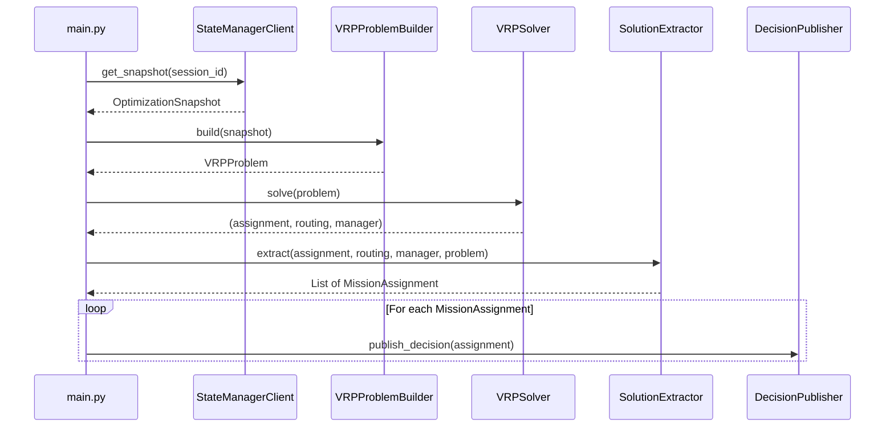

# Path Optimizer -- Technical Documentation

## 1. Service Overview

The **path_optimizer** is a batch optimization service that solves the
Vehicle Routing Problem with Pickup and Delivery (VRPPD) for a fleet of
medical-delivery drones. It is implemented in Python 3.11 and relies on
Google OR-Tools for the combinatorial optimization core.

The service runs as a one-shot process (designed to be triggered on a
rolling 10-second schedule via Cloud Run Jobs in production, or as a
Docker container locally). Each execution constitutes a single
**optimization cycle**:

1. Fetch the current world state from the State Manager.
2. Build a mathematical model of the routing problem.
3. Solve the model under physical and business constraints.
4. Publish the resulting mission assignments to Pub/Sub.

The service is stateless: it reads everything it needs from the State
Manager snapshot and produces output exclusively through the Pub/Sub
message bus.

### Position in the Global Architecture

```
Ingestion API --> Pub/Sub --> State Manager --> Firestore
                                    |
                          HTTP GET /snapshot
                                    |
                             Path Optimizer
                                    |
                          Pub/Sub (decisions)
                                    |
                             State Manager --> Firestore (missions)
```

---

## 2. Execution Flow

The entry point is `main.py :: run_optimization()`. The full lifecycle
of one optimization cycle is described below.




### Step-by-step Breakdown

| Step | Module | Description |
|------|--------|-------------|
| 1 | `clients/state_manager.py` | HTTP GET to `state-manager:8080/api/v1/optimizer/snapshot`. Deserializes the JSON response into an `OptimizationSnapshot` protobuf message (via betterproto). Handles enum mapping for `DroneStatus` and `OrderPriority`. |
| 2 | `services/builder.py` | Transforms the snapshot into a `VRPProblem` NamedTuple: computes the node graph, distance/time matrices, time windows, battery levels, and pickup-delivery pairs. |
| 3 | `services/solver.py` | Configures OR-Tools routing dimensions (distance, time, battery) and constraints (pickup-delivery, disjunctions), then invokes the solver with a configurable time limit (default 30 s). |
| 4 | `services/extractor.py` | Walks each vehicle route in the OR-Tools solution, classifies nodes by type, and builds `MissionAssignment` protobuf messages with waypoints and estimated metrics. |
| 5 | `clients/publisher.py` | Serializes each `MissionAssignment` to a dictionary and publishes it to the `decisions` Pub/Sub topic via the `dronefleet_messaging` library (Pub/Sub emulator in local environment). |

---

## 3. Data Model

### 3.1 Input: OptimizationSnapshot

The snapshot is a protobuf message fetched from the State Manager. It
contains everything the optimizer needs to build the problem:

| Field | Type | Description |
|-------|------|-------------|
| `session_id` | string | Unique identifier for this optimization cycle |
| `timestamp` | Timestamp | When the snapshot was created |
| `depot` | Depot | The main depot (start/end point for all drones). Contains `id`, `name`, `position` (lat/lon). |
| `drones` | List[Drone] | Available idle drones with `id`, `position`, `battery_percentage`, `status`, `home_depot_id`, `consumption_per_km`, `max_flight_time_minutes`. |
| `orders` | List[Order] | Pending delivery orders with `id`, `delivery_location`, `priority` (enum), `product_type` (string), `created_at`. |
| `warehouses` | List[Warehouse] | Pickup locations with `id`, `name`, `position`, `authorized_product_types` (list of strings), `is_cold_storage_capable`. |

### 3.2 Output: MissionAssignment

Each output message assigns a drone to a set of orders with a precise
route:

| Field | Type | Description |
|-------|------|-------------|
| `drone_id` | string | The assigned drone |
| `order_ids` | List[string] | Orders fulfilled in this mission |
| `route` | List[Waypoint] | Ordered sequence of waypoints (see below) |
| `estimated_battery_consumption` | double | Total estimated battery usage (%) |
| `estimated_duration_minutes` | double | Total estimated flight duration |

### 3.3 Waypoint and WaypointType Enum

Each waypoint in the route carries a type, a geographic position, and
optional references to the related order or warehouse:

| WaypointType Enum Value | Integer | Meaning |
|--------------------------|---------|---------|
| `WAYPOINT_TYPE_UNSPECIFIED` | 0 | Default / unused |
| `WAYPOINT_TYPE_DEPOT_START` | 1 | Drone departs from the depot |
| `WAYPOINT_TYPE_WAREHOUSE_PICKUP` | 2 | Drone picks up goods at a warehouse |
| `WAYPOINT_TYPE_HOSPITAL_DELIVERY` | 3 | Drone delivers goods to a hospital |
| `WAYPOINT_TYPE_DEPOT_RETURN` | 4 | Drone returns to the depot |

A typical single-order route looks like:

```
DEPOT_START --> WAREHOUSE_PICKUP --> HOSPITAL_DELIVERY --> DEPOT_RETURN
```

A multi-order route alternates pickups and deliveries:

```
DEPOT_START --> WAREHOUSE_PICKUP --> HOSPITAL_DELIVERY
            --> WAREHOUSE_PICKUP --> HOSPITAL_DELIVERY
            --> DEPOT_RETURN
```

---

## 4. VRP Graph Construction (builder.py)

### 4.1 Problem Classification

The problem solved here is a **Vehicle Routing Problem with Pickup and
Delivery (VRPPD)** -- a well-known variant of the classical VRP. In our
case:

- **Vehicles** are drones, each with heterogeneous battery levels.
- **Pickups** happen at warehouses (the goods must be collected before
  delivery).
- **Deliveries** happen at hospitals (the final destination for each
  order).
- Every drone starts and ends at the same **depot**.

This is further augmented with:

- **Time windows** on deliveries (priority-based deadlines).
- **Battery constraints** (energy consumption proportional to distance).
- **Product-warehouse compatibility** (a warehouse must stock the
  product type requested by the order).

### 4.2 Node Layout

The graph contains `2N + 1` nodes for N orders:

```
Index 0          : Depot (start/end for all vehicles)
Indices 1..N     : Pickup nodes (one per order, at nearest compatible warehouse)
Indices N+1..2N  : Delivery nodes (one per order, at the order's destination)
```

**Critical design decision -- unique pickup nodes per order:**

Each order gets its own dedicated pickup node, even though multiple
orders may be picked up from the same physical warehouse. This is
mandatory because OR-Tools `AddPickupAndDelivery(p, d)` requires a
strict 1-to-1 relationship between pickup and delivery nodes. If
multiple orders shared the same warehouse node as their pickup, OR-Tools
would interpret the constraints as requiring that single node to appear
on every vehicle's route simultaneously -- an impossible condition that
makes the entire problem infeasible.

### 4.3 Warehouse Selection Strategy

For each order, the builder selects the **nearest compatible warehouse**
(by Haversine distance to the delivery location). A warehouse is
compatible if its `authorized_product_types` list contains the order's
`product_type`.

### 4.4 Distance and Time Matrices

Two `(2N+1) x (2N+1)` matrices are computed:

- **Distance matrix** (meters): pairwise Haversine distances between all
  node coordinates. Haversine accounts for Earth's curvature and is
  suitable for the short distances involved (urban area, typically
  < 30 km).

- **Time matrix** (seconds): derived from the distance matrix assuming a
  constant drone cruising speed of **50 km/h** (13.89 m/s).

The matrix computation has **O(n^2)** complexity where n = 2N+1 is the
total number of nodes.

### 4.5 Time Windows

Each node receives a time window `(earliest, latest)` in seconds:

| Node type | Time window |
|-----------|-------------|
| Depot | (0, 10800) -- 3 hours |
| Pickup | (0, 10800) -- 3 hours (flexible) |
| Delivery (CRITICAL) | (0, 900) -- 15 minutes |
| Delivery (HIGH) | (0, 1800) -- 30 minutes |
| Delivery (STANDARD) | (0, 3600) -- 60 minutes |

The time windows represent deadlines relative to the start of the
optimization horizon.

---

## 5. Solver Dimensions and Constraints (solver.py)

The solver uses OR-Tools' `RoutingModel` API which is built on top of a
constraint-programming engine. The problem is expressed through
**dimensions** (cumulative variables tracked along each route) and
**constraints** (logical conditions that must hold).

### 5.1 Distance Dimension

- **Transit callback**: returns the distance in meters between two nodes.
- **Arc cost**: the distance callback is also used as the arc cost
  evaluator, meaning the solver minimizes total distance traveled.
- **Upper bound**: 100 km per route. This is intentionally generous;
  the battery dimension is the real physical limiter.
- **Start cumul**: fixed at zero.
- **Global span cost coefficient**: 100. This penalizes imbalance
  between the longest and shortest routes, encouraging even workload
  distribution across drones.

### 5.2 Time Dimension

- **Transit callback**: returns travel time in seconds between two nodes.
- **Slack**: up to 30 minutes. Slack allows a drone to "wait" at a node
  before proceeding, which gives the solver flexibility to satisfy time
  windows.
- **Horizon**: 3 hours (10800 seconds) maximum cumulative time per
  route.
- **Start cumul**: free (not fixed to zero). This allows the solver to
  choose when each drone departs, rather than forcing all drones to
  leave at time 0.
- **Time windows**: applied only to delivery nodes via
  `CumulVar(index).SetRange(earliest, latest)`.

### 5.3 Battery Dimension

The battery dimension tracks **cumulative energy consumption** (not
remaining charge) along each route:

- **Transit callback**: `consumption = distance_km * 2.5 * 10` (scaled
  by 10 for integer precision; 1 unit = 0.1% battery).
- **Consumption rate**: 2.5% per kilometer (a reasonable estimate for a
  delivery drone).
- **Start cumul**: fixed at zero (consumption starts at nothing).
- **Upper bound**: 1000 units (representing 100% theoretical maximum).
- **Per-vehicle constraint**: for each drone, the cumulative consumption
  at the end node is capped at
  `initial_battery_pct * 10 - 200` (i.e., the drone must retain at
  least **20% battery** upon returning to the depot).

Example: a drone starting at 85% battery can consume at most
`(85 - 20) * 10 = 650` units, which corresponds to
`650 / (2.5 * 10) = 26 km` of total flight distance.

### 5.4 Pickup-Delivery Constraints

For each order's pickup-delivery pair `(p, d)`:

1. **`AddPickupAndDelivery(p, d)`**: tells OR-Tools that p and d form a
   coupled pair.
2. **Same vehicle**: `VehicleVar(p) == VehicleVar(d)` -- the pickup and
   delivery must be performed by the same drone.
3. **Ordering**: `CumulVar(p) <= CumulVar(d)` on the distance dimension
   -- the pickup must happen before the delivery.

### 5.5 Disjunctions (Graceful Order Dropping)

Each pickup node and each delivery node is wrapped in its own
`AddDisjunction` with a penalty of **100,000**:

```python
routing.AddDisjunction([pickup_index], DROP_PENALTY)
routing.AddDisjunction([delivery_index], DROP_PENALTY)
```

A disjunction tells OR-Tools that a node can optionally be skipped if
visiting it would make the problem infeasible, at the cost of the
specified penalty. When one node of a pickup-delivery pair is dropped,
the same-vehicle constraint forces the other node to be dropped as well.

This mechanism is essential because some orders may be physically
unreachable given the battery constraints (e.g., a round trip exceeding
the drone's range). Without disjunctions, a single infeasible order
would make the entire problem unsolvable and no drone would be assigned
any mission.

The total penalty for dropping one order is `2 * DROP_PENALTY = 200,000`
(one disjunction penalty for the pickup, one for the delivery). Since
the distance-based objective values are typically in the range of
thousands to low millions of meters, this penalty is high enough to
ensure orders are only dropped as a last resort.

---

## 6. Algorithm Selection and Complexity Analysis

### 6.1 The VRP Problem Class

The Vehicle Routing Problem with Pickup and Delivery (VRPPD) is a
variant of the Capacitated Vehicle Routing Problem (CVRP). CVRP itself
is **NP-hard** (proven by reduction from the Travelling Salesman
Problem). Adding pickup-delivery pairing, time windows, and
heterogeneous vehicle constraints does not reduce the complexity -- the
problem remains firmly in the NP-hard class.

This means no polynomial-time algorithm is known that can guarantee an
optimal solution. Exact methods (branch-and-bound, branch-and-cut) can
solve small instances but scale poorly. For real-time operational use,
heuristic and metaheuristic methods are the standard approach.

### 6.2 Solution Strategy: Two-Phase Approach

OR-Tools uses a two-phase strategy:

#### Phase 1: Initial Solution (PARALLEL_CHEAPEST_INSERTION)

`PARALLEL_CHEAPEST_INSERTION` is a constructive heuristic:

- It considers all unrouted nodes simultaneously across all vehicles.
- At each step, it inserts the node that causes the smallest increase
  in total cost into the best position of any route.
- It continues until all nodes are inserted or determined infeasible.

This is a greedy algorithm with complexity **O(n^2 * V)** where n is the
number of nodes and V is the number of vehicles. For our typical problem
size (37 nodes, 5 vehicles), this phase completes in milliseconds.

#### Phase 2: Improvement (GUIDED_LOCAL_SEARCH)

`GUIDED_LOCAL_SEARCH` (GLS) is a **metaheuristic** that improves the
initial solution iteratively:

- It performs local search moves (relocate a node, swap nodes between
  routes, move segments of routes, etc.).
- When the search gets stuck in a local optimum, GLS penalizes
  frequently appearing "features" (specific arcs) in the current
  solution, effectively guiding the search away from previously
  explored regions of the solution space.
- It continues until the time limit is reached (default: 10 seconds).

GLS does not guarantee global optimality. It is an **anytime algorithm**:
the longer it runs, the better the solution tends to be, but there is no
certificate of optimality.

Each iteration of the local search evaluates neighborhood moves in
**O(n^2)** time (checking all pairwise swaps/relocations). The number of
iterations is bounded only by the wall-clock time limit.

### 6.3 Complexity Comparison

| Approach | Time Complexity | Optimality | Practical Use |
|----------|----------------|------------|---------------|
| Exact (branch-and-bound) | O(n! / symmetries) worst case | Proven optimal | Feasible for n < 20-30 nodes |
| MILP (Mixed Integer Linear Programming) | Exponential worst case | Proven optimal | Feasible for n < 50-100 with strong formulations |
| Constructive heuristic (nearest neighbor) | O(n^2) | No guarantee, often 15-25% from optimal | Very fast, poor quality |
| PARALLEL_CHEAPEST_INSERTION | O(n^2 * V) | No guarantee, typically 10-20% from optimal | Fast, reasonable quality |
| GLS metaheuristic (our choice) | O(n^2) per iteration, bounded by time limit | No guarantee, typically 1-5% from optimal | Best balance of speed and quality |
| Genetic algorithms | O(P * n^2 * G) where P=population, G=generations | No guarantee, variable quality | Slower convergence than GLS for routing |
| Simulated annealing | O(n^2) per iteration, bounded by temperature schedule | No guarantee | Good but GLS generally outperforms on VRP |

### 6.4 Our System's Practical Complexity

For a typical instance with D drones, N orders, and W warehouses:

- **Graph construction**: O((2N+1)^2) for distance/time matrices
- **Initial solution**: O((2N+1)^2 * D) -- milliseconds
- **Metaheuristic improvement**: O((2N+1)^2) per iteration, iterated
  for the duration of the time limit
- **Solution extraction**: O(D * N) -- linear walk of all routes

With the current seed data (5 drones, 18 orders, 2 warehouses =
37 nodes), the solver finds a high-quality solution well within the
30-second time limit. The system is designed to scale to the MVP target
of 50-100 drones with hundreds of orders by adjusting the time limit
and potentially sharding the problem geographically.

---

## 7. Solution Extraction (extractor.py)

After the solver produces an assignment, the `SolutionExtractor` walks
each vehicle's route to build `MissionAssignment` messages.

### Extraction Algorithm

For each vehicle (drone):

1. Start at `routing.Start(vehicle_id)`.
2. Follow `assignment.Value(routing.NextVar(index))` until
   `routing.IsEnd(index)` is reached.
3. Collect all intermediate node indices.
4. Classify each node:
   - **Depot node** (index 0): `WAYPOINT_TYPE_DEPOT_START` if first,
     `WAYPOINT_TYPE_DEPOT_RETURN` if last.
   - **Pickup node** (in `pickup_nodes` set): `WAYPOINT_TYPE_WAREHOUSE_PICKUP`.
     References the warehouse via `pickup_node_to_warehouse_id`.
   - **Delivery node** (in `delivery_nodes` set): `WAYPOINT_TYPE_HOSPITAL_DELIVERY`.
     References the order via `delivery_node_to_order_id`.
5. Compute aggregate metrics:
   - Total distance (sum of pairwise distances along the route).
   - Total time (sum of pairwise travel times).
   - Battery consumption (`total_distance_km * 2.5`).
6. Skip idle drones (routes with only depot-start and depot-return).

### Output

Each non-trivial route produces one `MissionAssignment` message
containing the drone assignment, the list of fulfilled order IDs, the
ordered waypoint sequence, and the estimated battery/time metrics.

---

## 8. Publishing (publisher.py)

The `DecisionPublisher` class serializes each `MissionAssignment` to a
Python dictionary (via betterproto's `to_dict()`) and publishes it to
the `decisions` Pub/Sub topic.

The publishing layer uses the `dronefleet_messaging` library which
abstracts the message bus implementation:

- **Local environment**: connects to the Pub/Sub emulator at
  `pubsub-emulator:8085`.
- **Cloud environments (dev/prod)**: connects to Google Cloud Pub/Sub.

The State Manager's `DecisionListener` subscribes to this topic and
processes each mission assignment, creating the mission in Firestore
and updating drone/order statuses atomically.

---

## 9. Configuration

The service reads its configuration from environment variables via the
`dronefleet_shared.utils.global_config` module:

| Variable | Default | Description |
|----------|---------|-------------|
| `STATE_MANAGER_URL` | `http://state-manager:8080` | Base URL of the State Manager REST API |
| `PUBSUB_TOPIC_DECISIONS` | `decisions` | Pub/Sub topic for publishing mission assignments |
| `ENVIRONMENT` | `local` | Determines which `.env` file to load (`local`, `dev`, `prod`) |
| `PUBSUB_EMULATOR_HOST` | `pubsub-emulator:8085` | Emulator host (local only) |

---

## 10. File Reference

| File | Responsibility |
|------|----------------|
| `main.py` | Entry point; orchestrates the optimization cycle |
| `clients/state_manager.py` | HTTP client for fetching the optimization snapshot |
| `clients/publisher.py` | Pub/Sub publisher for mission assignment decisions |
| `services/builder.py` | Transforms snapshot into VRP graph (`VRPProblem`) |
| `services/solver.py` | Configures and runs the OR-Tools VRP solver |
| `services/extractor.py` | Extracts mission assignments from the OR-Tools solution |
