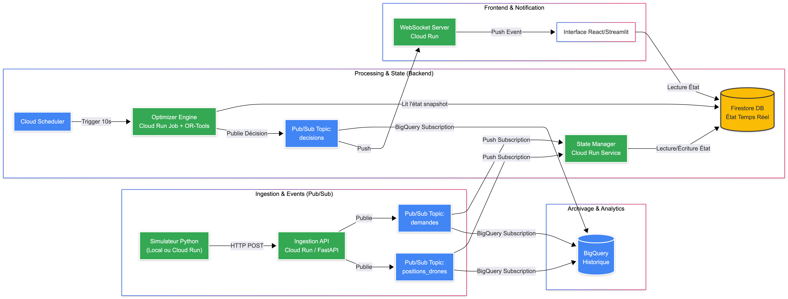

 # PROJECT_CONTEXT.md - DroneFleet Optimizer

> **INSTRUCTION POUR L'IA :** Ce document est la source de vérité absolue du projet. Agis en tant que Lead Developer / Architecte Cloud. Réfère-toi toujours à ces contraintes, cette stack et cette architecture avant de proposer du code.

## 1. Vision & Business Case
**Nom du Produit :** DroneFleet Optimizer (LifeLine Logistics)
**Le Pitch :** Une plateforme de logistique autonome capable de livrer du matériel médical d'urgence (sang, vaccins, défibrillateurs) en moins de 15 minutes en zone urbaine, en coordonnant une flotte de drones via un algorithme central (de recherche opérationelle ou plus tard de metaheuristique).

**Niveau d'Exigence :** "Enterprise Grade".
Ce n'est pas un POC jetable. Le code doit être :
* **Typé strictement** (Pydantic pour Python, Typage fort pour Java).
* **Résilient** (Gestion des erreurs, Retry policies, Dead Letter Queues).
* **Agnostique** (Architecture Hexagonale pour découpler la logique métier de l'infra).
* **Bonne pratique only** (Respecte toujours les règles du 12 Factor App de 12factor.net, utilise des Design Pattern, pense en séparant les environnement, accorde beacuoup d'importance à la sécurité)
* **Commentaires et explications** (Expliquer au maximum les choix et le code avec des commentaires. Ne JAMAIS mettre d'Emoji nulle part et écrire des commentaires professionels, propres, concis, impersonels et en Anglais)

L'objectif final sur le long terme est d'obtenir un projet digne d'une entreprise Tech qui impressionne en entretien et qui témoigne d'une grande maitrise et experience.

## 2. Métriques & Contraintes (SLAs)
* **Latence Visuelle :** < 500ms (Temps réel mou).
* **Cycle d'Optimisation :** Batch toutes les 10 secondes (Rolling Horizon Planning).
* **Échelle (Scale) :** 50 à 100 drones actifs simultanés pour le MVP.
* **Fiabilité :** Aucune perte de commande ("At-Least-Once" delivery).
* **FinOps :** Optimisation des coûts Firestore (Batch writes) pour rester compatible Free Tier/Low Cost en dev.

## 3. Architecture Technique (Hybride & Hexagonale)

### A. La Stack "Polyglotte"



| Composant | Langage / Framework | Infra Local (Dev) | Infra Prod (GCP) | Rôle |
| :--- | :--- | :--- | :--- | :--- |
| **Ingestion API** | Python 3.11 / **FastAPI** | Docker Compose | Cloud Run (Service) | Gateway d'entrée, Validation JSON, Push to PubSub. |
| **Message Bus** | - | **Pub/Sub Emulator** | Google Pub/Sub | Bus d'événements asynchrone. |
| **State Manager** | **Java 21 / Spring Boot 4** | Docker Compose | Cloud Run (Native) | Consomme les events, gère la cohérence, écrit en DB. |
| **Optimizer** | Python 3.11 / **OR-Tools** | Docker Compose | Cloud Run (Job) | Résout le VRP (Vehicle Routing Problem). |
| **Database** | - | **Firestore Emulator** | Firestore (NoSQL) | Stockage de l'état "Chaud" (Hot Storage). |
| **Frontend** | Python / **Streamlit** | Docker Compose | Cloud Run | Visualisation cartographique. |

### B. Pattern d'Adaptateur (Adapter Pattern)
Le code doit être agnostique de l'infrastructure via des interfaces.
* **Stratégie actuelle :** `ON_CLOUD` (Simulé localement via Emulateurs).
* **Stratégie future (Optionnelle) :** `ON_PREMISE` (Kafka + Postgres sur K8s).
* **Règle :** L'API d'ingestion ne doit pas importer `google.cloud.pubsub` directement dans le service, mais passer par une interface `EventDispatcher`.

### C. Synchronisation des Modèles (Protobuf & Buf)
Le projet utilise **Protobuf** comme source de vérité unique pour les modèles de données partagés.
* **Outil :** [Buf](https://buf.build/) est utilisé pour le linting, la détection de breaking changes et la génération de code.
* **Génération :** La commande `mise run //shared/proto:generate` (définie dans `shared/proto/mise.toml`) synchronise les fichiers `.proto` vers les dossiers `shared/*/models/`.
* **Automation :**
    * **Local :** Un hook `pre-commit` (via `.pre-commit-config.yaml`) vérifie automatiquement la synchronisation des modèles avant chaque commit.
    * **CI/CD :** Le workflow `ci.yml` valide les schémas (`buf lint`, `buf breaking`) et la synchronisation. Le déploiement via `cd-dev.yml` s'assure de la cohérence globale avant intégration.

## 4. Flux de Données (Data Flow)

1.  **Ingestion :**
    * `Simulator` -> HTTP POST -> `Ingestion API`
    * Validation Pydantic -> Push dans Topic `telemetry` ou `orders`.
2.  **State Management (Hot Path) :**
    * `State Manager (Java)` écoute `telemetry`.
    * Met à jour l'état en mémoire + Persistance optimisée (Firestore).
3.  **Optimisation (Batch - 10s) :**
    * `Optimizer (Python)` se réveille.
    * Récupère le snapshot global (Drones + Commandes en attente).
    * Calcule les trajets (VRP with Pickup & Delivery).
    * Publie les `MissionOrders` dans Topic `commands`.
4.  **Distribution :**
    * `State Manager` reçoit `commands`, met à jour le statut des drones et notifie le Frontend.

## 5. Structure du Projet (Monorepo)

```text
drone-fleet-optimizer/
.
├── AGENTS.md
├── biome.json
├── btca.config.jsonc
├── build
│   ├── classes
│   │   └── java
│   │       ├── main
│   │       └── test
│   └── resources
│       ├── main
│       └── test
├── build.gradle
├── configs
│   ├── dev.env
│   ├── local.env
│   └── prod.env
├── docs
│   ├── images
│   │   ├── global_architecture_png.png
│   │   └── global_architecture.svg
│   └── roadmap_technique.md
├── gradle
│   └── wrapper
│       ├── gradle-wrapper.jar
│       └── gradle-wrapper.properties
├── gradlew
├── gradlew.bat
├── infra
│   ├── local
│   │   ├── docker-compose.yml
│   │   ├── mise.toml
│   │   └── scripts
│   │       ├── create_topics.py
│   │       ├── debug_pubsub.py
│   │       └── pubsub_tool.py
│   ├── scripts
│   │   ├── test_firestore.py
│   │   └── test_optimizer.py
│   └── terraform
│       ├── environments
│       │   ├── dev
│       │   │   ├── backend.tf
│       │   │   ├── main.tf
│       │   │   └── variables.tf
│       │   └── prod
│       │       ├── backend.tf
│       │       ├── main.tf
│       │       └── variables.tf
│       └── modules
│           ├── cloud-run
│           │   └── main.tf
│           ├── firestore
│           │   └── main.tf
│           ├── iam
│           │   ├── main.tf
│           │   └── variables.tf
│           └── pubsub
│               ├── main.tf
│               ├── outputs.tf
│               └── variables.tf
├── libs
│   ├── java
│   │   ├── config
│   │   │   ├── build
│   │   │   │   ├── classes
│   │   │   │   │   └── java
│   │   │   │   │       ├── main
│   │   │   │   │       └── test
│   │   │   │   └── resources
│   │   │   │       ├── main
│   │   │   │       └── test
│   │   │   └── build.gradle
│   │   └── logging
│   │       ├── build
│   │       │   ├── classes
│   │       │   │   └── java
│   │       │   │       ├── main
│   │       │   │       └── test
│   │       │   └── resources
│   │       │       ├── main
│   │       │       └── test
│   │       └── build.gradle
│   ├── python
│   │   ├── config
│   │   │   └── pyproject.toml
│   │   ├── logging
│   │   │   └── pyproject.toml
│   │   └── messaging
│   │       ├── pyproject.toml
│   │       └── src
│   │           └── dronefleet_messaging
│   │               ├── __init__.py
│   │               ├── base_publisher.py
│   │               ├── factory.py
│   │               └── publisher
│   │                   ├── __init__.py
│   │                   ├── kafka_publisher.py
│   │                   └── pubsub_publisher.py
│   └── ts
│       ├── config
│       │   └── package.json
│       └── logging
│           └── package.json
├── LICENSE
├── mise.toml
├── package.json
├── pnpm-workspace.yaml
├── pyproject.toml
├── README.md
├── restructure.md
├── services
│   ├── ingestion
│   │   ├── Dockerfile
│   │   ├── mise.toml
│   │   ├── pyproject.toml
│   │   ├── README.md
│   │   └── src
│   │       └── ingestion
│   │           ├── __init__.py
│   │           ├── api
│   │           │   ├── __init__.py
│   │           │   ├── tests
│   │           │   └── v1
│   │           │       ├── __init__.py
│   │           │       └── endpoints
│   │           │           ├── __init__.py
│   │           │           ├── orders.py
│   │           │           └── telemetry.py
│   │           ├── main.py
│   │           ├── messaging
│   │           │   └── __init__.py
│   │           └── services
│   │               ├── __init__.py
│   │               ├── order.py
│   │               └── telemetry.py
│   ├── path_optimizer
│   │   ├── Dockerfile
│   │   ├── mise.toml
│   │   ├── pyproject.toml
│   │   └── src
│   │       └── path_optimizer
│   │           ├── __init__.py
│   │           ├── clients
│   │           │   ├── __init__.py
│   │           │   ├── publisher.py
│   │           │   └── state_manager.py
│   │           ├── main.py
│   │           ├── models
│   │           │   ├── __init__.py
│   │           │   ├── decision.py
│   │           │   └── snapshot.py
│   │           └── services
│   │               ├── __init__.py
│   │               ├── builder.py
│   │               ├── extractor.py
│   │               └── solver.py
│   ├── simulators
│   │   ├── mise.toml
│   │   ├── pyproject.toml
│   │   └── src
│   │       └── simulators
│   │           ├── __init__.py
│   │           └── main.py
│   ├── state_manager
│   │   ├── bin
│   │   │   ├── default
│   │   │   ├── generated-sources
│   │   │   │   └── annotations
│   │   │   ├── generated-test-sources
│   │   │   │   └── annotations
│   │   │   ├── main
│   │   │   └── test
│   │   ├── build
│   │   │   ├── classes
│   │   │   │   └── java
│   │   │   │       ├── main
│   │   │   │       │   ├── com
│   │   │   │       │   │   └── dronefleet
│   │   │   │       │   │       └── statemanager
│   │   │   │       │   │           ├── application
│   │   │   │       │   │           │   ├── config
│   │   │   │       │   │           │   │   ├── AppProperties.class
│   │   │   │       │   │           │   │   ├── FirestoreConfig.class
│   │   │   │       │   │           │   │   ├── LocalGcpConfig.class
│   │   │   │       │   │           │   │   └── PubSubConfig.class
│   │   │   │       │   │           │   └── dto
│   │   │   │       │   │           │       ├── MissionAssignmentDto.class
│   │   │   │       │   │           │       ├── MissionAssignmentDto$GeoPointDto.class
│   │   │   │       │   │           │       ├── OptimizationSnapshotDto.class
│   │   │   │       │   │           │       ├── OptimizationSnapshotDto$DroneSnapshotDto.class
│   │   │   │       │   │           │       ├── OptimizationSnapshotDto$OrderSnapshotDto.class
│   │   │   │       │   │           │       ├── OptimizationSnapshotDto$PositionDto.class
│   │   │   │       │   │           │       ├── OptimizationSnapshotDto$WarehouseSnapshotDto.class
│   │   │   │       │   │           │       ├── OrderEventDto.class
│   │   │   │       │   │           │       ├── OrderEventDto$GeoPointDto.class
│   │   │   │       │   │           │       ├── TelemetryEventDto.class
│   │   │   │       │   │           │       └── TelemetryEventDto$GeoPointDto.class
│   │   │   │       │   │           ├── domain
│   │   │   │       │   │           │   ├── exception
│   │   │   │       │   │           │   │   ├── BusinessRejectionException.class
│   │   │   │       │   │           │   │   └── DomainException.class
│   │   │   │       │   │           │   ├── port
│   │   │   │       │   │           │   │   ├── in
│   │   │   │       │   │           │   │   │   ├── AssignMissionUseCase.class
│   │   │   │       │   │           │   │   │   ├── GetFleetSnapshotUseCase.class
│   │   │   │       │   │           │   │   │   ├── GetOptimizationSnapshotUseCase.class
│   │   │   │       │   │           │   │   │   ├── ProcessOrderUseCase.class
│   │   │   │       │   │           │   │   │   └── UpdateDroneStateUseCase.class
│   │   │   │       │   │           │   │   └── out
│   │   │   │       │   │           │   │       ├── DroneRepository.class
│   │   │   │       │   │           │   │       ├── MissionRepository.class
│   │   │   │       │   │           │   │       ├── OrderRepository.class
│   │   │   │       │   │           │   │       ├── StateTransactionPort.class
│   │   │   │       │   │           │   │       ├── StateTransactionPort$DroneOrderContext.class
│   │   │   │       │   │           │   │       ├── StateTransactionPort$MissionAssignmentResult.class
│   │   │   │       │   │           │   │       └── WarehouseRepository.class
│   │   │   │       │   │           │   └── service
│   │   │   │       │   │           │       ├── DroneStateService.class
│   │   │   │       │   │           │       ├── MissionAssignmentPolicy.class
│   │   │   │       │   │           │       ├── MissionCreationService.class
│   │   │   │       │   │           │       ├── OptimizationSnapshotService.class
│   │   │   │       │   │           │       └── OrderStateService.class
│   │   │   │       │   │           ├── infrastructure
│   │   │   │       │   │           │   └── adapter
│   │   │   │       │   │           │       ├── in
│   │   │   │       │   │           │       │   ├── messaging
│   │   │   │       │   │           │       │   │   └── pubsub
│   │   │   │       │   │           │       │   │       ├── DecisionListener.class
│   │   │   │       │   │           │       │   │       ├── OrderListener.class
│   │   │   │       │   │           │       │   │       └── TelemetryListener.class
│   │   │   │       │   │           │       │   └── rest
│   │   │   │       │   │           │       │       └── SampleController.class
│   │   │   │       │   │           │       └── out
│   │   │   │       │   │           │           └── persistence
│   │   │   │       │   │           │               └── firestore
│   │   │   │       │   │           │                   ├── FirestoreDroneRepository.class
│   │   │   │       │   │           │                   ├── FirestoreMapper.class
│   │   │   │       │   │           │                   ├── FirestoreMissionRepository.class
│   │   │   │       │   │           │                   ├── FirestoreOrderRepository.class
│   │   │   │       │   │           │                   ├── FirestoreStateTransactionAdapter.class
│   │   │   │       │   │           │                   └── FirestoreWarehouseRepository.class
│   │   │   │       │   │           └── StateManagerApplication.class
│   │   │   │       │   └── META-INF
│   │   │   │       │       └── spring-configuration-metadata.json
│   │   │   │       └── test
│   │   │   │           └── com
│   │   │   │               └── dronefleet
│   │   │   │                   └── statemanager
│   │   │   │                       ├── domain
│   │   │   │                       │   ├── model
│   │   │   │                       │   │   └── DroneTest.class
│   │   │   │                       │   └── service
│   │   │   │                       │       └── MissionAssignmentPolicyTest.class
│   │   │   │                       └── StateManagerApplicationTests.class
│   │   │   ├── generated
│   │   │   │   └── sources
│   │   │   │       ├── annotationProcessor
│   │   │   │       │   └── java
│   │   │   │       │       ├── main
│   │   │   │       │       └── test
│   │   │   │       └── headers
│   │   │   │           └── java
│   │   │   │               ├── main
│   │   │   │               └── test
│   │   │   ├── resources
│   │   │   │   ├── main
│   │   │   │   │   ├── application-dev.yml
│   │   │   │   │   ├── application-local.yml
│   │   │   │   │   └── application.yaml
│   │   │   │   └── test
│   │   │   └── tmp
│   │   │       ├── compileJava
│   │   │       │   └── previous-compilation-data.bin
│   │   │       └── compileTestJava
│   │   │           └── previous-compilation-data.bin
│   │   ├── build.gradle
│   │   ├── config
│   │   │   └── checkstyle
│   │   │       └── checkstyle.xml
│   │   ├── Dockerfile
│   │   ├── mise.toml
│   │   └── src
│   │       ├── main
│   │       │   ├── java
│   │       │   │   └── com
│   │       │   │       └── dronefleet
│   │       │   │           └── statemanager
│   │       │   │               ├── application
│   │       │   │               │   ├── config
│   │       │   │               │   │   ├── AppProperties.java
│   │       │   │               │   │   ├── FirestoreConfig.java
│   │       │   │               │   │   ├── LocalGcpConfig.java
│   │       │   │               │   │   └── PubSubConfig.java
│   │       │   │               │   └── dto
│   │       │   │               │       ├── MissionAssignmentDto.java
│   │       │   │               │       ├── OptimizationSnapshotDto.java
│   │       │   │               │       ├── OrderEventDto.java
│   │       │   │               │       └── TelemetryEventDto.java
│   │       │   │               ├── domain
│   │       │   │               │   ├── exception
│   │       │   │               │   │   ├── BusinessRejectionException.java
│   │       │   │               │   │   └── DomainException.java
│   │       │   │               │   ├── port
│   │       │   │               │   │   ├── in
│   │       │   │               │   │   │   ├── AssignMissionUseCase.java
│   │       │   │               │   │   │   ├── GetFleetSnapshotUseCase.java
│   │       │   │               │   │   │   ├── GetOptimizationSnapshotUseCase.java
│   │       │   │               │   │   │   ├── ProcessOrderUseCase.java
│   │       │   │               │   │   │   └── UpdateDroneStateUseCase.java
│   │       │   │               │   │   └── out
│   │       │   │               │   │       ├── DroneRepository.java
│   │       │   │               │   │       ├── MissionRepository.java
│   │       │   │               │   │       ├── OrderRepository.java
│   │       │   │               │   │       ├── StateTransactionPort.java
│   │       │   │               │   │       └── WarehouseRepository.java
│   │       │   │               │   └── service
│   │       │   │               │       ├── DroneStateService.java
│   │       │   │               │       ├── MissionAssignmentPolicy.java
│   │       │   │               │       ├── MissionCreationService.java
│   │       │   │               │       ├── OptimizationSnapshotService.java
│   │       │   │               │       └── OrderStateService.java
│   │       │   │               ├── infrastructure
│   │       │   │               │   └── adapter
│   │       │   │               │       ├── in
│   │       │   │               │       │   ├── messaging
│   │       │   │               │       │   │   └── pubsub
│   │       │   │               │       │   │       ├── DecisionListener.java
│   │       │   │               │       │   │       ├── OrderListener.java
│   │       │   │               │       │   │       └── TelemetryListener.java
│   │       │   │               │       │   └── rest
│   │       │   │               │       │       └── SampleController.java
│   │       │   │               │       └── out
│   │       │   │               │           └── persistence
│   │       │   │               │               └── firestore
│   │       │   │               │                   ├── FirestoreDroneRepository.java
│   │       │   │               │                   ├── FirestoreMapper.java
│   │       │   │               │                   ├── FirestoreMissionRepository.java
│   │       │   │               │                   ├── FirestoreOrderRepository.java
│   │       │   │               │                   ├── FirestoreStateTransactionAdapter.java
│   │       │   │               │                   └── FirestoreWarehouseRepository.java
│   │       │   │               └── StateManagerApplication.java
│   │       │   └── resources
│   │       │       ├── application-dev.yml
│   │       │       ├── application-local.yml
│   │       │       └── application.yaml
│   │       └── test
│   │           └── java
│   │               └── com
│   │                   └── dronefleet
│   │                       └── statemanager
│   │                           ├── domain
│   │                           │   ├── model
│   │                           │   │   └── DroneTest.java
│   │                           │   └── service
│   │                           │       └── MissionAssignmentPolicyTest.java
│   │                           └── StateManagerApplicationTests.java
│   └── visualizer
│       ├── bun.lock
│       ├── Dockerfile
│       ├── index.html
│       ├── mise.toml
│       ├── package-lock.json
│       ├── package.json
│       ├── postcss.config.js
│       ├── server
│       │   ├── index.ts
│       │   ├── instrumentation.ts
│       │   ├── logger.ts
│       │   └── pubsub-client.ts
│       ├── src
│       │   ├── components
│       │   │   ├── ConfigPanel.tsx
│       │   │   ├── DebugPanel.tsx
│       │   │   ├── DroneMap.tsx
│       │   │   └── DronePopup.tsx
│       │   ├── data
│       │   │   ├── index.ts
│       │   │   └── telemetry-stream.ts
│       │   ├── index.css
│       │   ├── main.tsx
│       │   ├── stores
│       │   │   ├── debug.ts
│       │   │   ├── drones.ts
│       │   │   ├── index.ts
│       │   │   └── user-config.ts
│       │   └── utils
│       │       └── config.ts
│       ├── tailwind.config.js
│       ├── tsconfig.json
│       └── vite.config.ts
├── settings.gradle
├── shared
│   ├── build.gradle
│   └── src
│       └── main
│           └── java
│               └── com
│                   └── dronefleet
│                       └── shared
│                           └── models
│                               ├── ActionType.java
│                               ├── CommonProto.java
│                               ├── Depot.java
│                               ├── DepotOrBuilder.java
│                               ├── DepotProto.java
│                               ├── Drone.java
│                               ├── DroneOrBuilder.java
│                               ├── DroneProto.java
│                               ├── DroneStatus.java
│                               ├── DroneTelemetry.java
│                               ├── DroneTelemetryOrBuilder.java
│                               ├── Mission.java
│                               ├── MissionAssignment.java
│                               ├── MissionAssignmentOrBuilder.java
│                               ├── MissionOrBuilder.java
│                               ├── MissionProto.java
│                               ├── OptimizationSnapshot.java
│                               ├── OptimizationSnapshotOrBuilder.java
│                               ├── Order.java
│                               ├── OrderOrBuilder.java
│                               ├── OrderPriority.java
│                               ├── OrderProto.java
│                               ├── OrderStatus.java
│                               ├── Position.java
│                               ├── PositionOrBuilder.java
│                               ├── ProductType.java
│                               ├── SnapshotProto.java
│                               ├── Warehouse.java
│                               ├── WarehouseOrBuilder.java
│                               ├── WarehouseProto.java
│                               ├── Waypoint.java
│                               ├── WaypointOrBuilder.java
│                               └── WaypointType.java
├── proto
│   ├── buf.gen.yaml
│   ├── buf.yaml
│   ├── dronefleet
│   │   └── v1
│   │       ├── common.proto
│   │       ├── depot.proto
│   │       ├── drone.proto
│   │       ├── mission.proto
│   │       ├── order.proto
│   │       ├── snapshot.proto
│   │       └── warehouse.proto
│   ├── mise.toml
│   └── scripts
│       └── fix_python_init.py
├── python
│   ├── pyproject.toml
│   └── src
│       └── dronefleet_shared
│           ├── __init__.py
│           ├── __pycache__
│           │   ├── __init__.cpython-311.pyc
│           │   ├── __init__.cpython-313.pyc
│           │   ├── schemas.cpython-311.pyc
│           │   └── schemas.cpython-313.pyc
│           ├── models
│           │   ├── __init__.py
│           │   ├── __pycache__
│           │   │   ├── __init__.cpython-311.pyc
│           │   │   ├── order.cpython-311.pyc
│           │   │   ├── product.cpython-311.pyc
│           │   │   ├── protocol.cpython-311.pyc
│           │   │   └── telemetry.cpython-311.pyc
│           │   └── dronefleet
│           │       ├── __init__.py
│           │       ├── __pycache__
│           │       │   ├── __init__.cpython-311.pyc
│           │       │   └── v1.cpython-311.pyc
│           │       └── v1.py
│           ├── schemas.py
│           └── utils
│               ├── __init__.py
│               ├── __pycache__
│               │   ├── __init__.cpython-311.pyc
│               │   ├── __init__.cpython-313.pyc
│               │   ├── global_config.cpython-311.pyc
│               │   ├── global_config.cpython-313.pyc
│               │   └── logging_config.cpython-311.pyc
│               ├── global_config.py
│               └── logging_config.py
├── ts
│   ├── bun.lock
│   ├── package.json
│   ├── README.md
│   ├── src
│   │   ├── index.ts
│   │   └── schemas
│   │       ├── dronefleet
│   │       │   └── v1
│   │       │       ├── common.ts
│   │       │       ├── depot.ts
│   │       │       ├── drone.ts
│   │       │       ├── mission.ts
│   │       │       ├── order.ts
│   │       │       ├── snapshot.ts
│   │       │       └── warehouse.ts
│   │       ├── google
│   │       │   └── protobuf
│   │       │       └── timestamp.ts
│   │       └── index.ts
│   └── tsconfig.json
│
├── tests
│   ├── e2e
│   ├── integration
│   └── unit
├── tsconfig.base.json
└── uv.lock
```

## 6. Environnements isolés

```
┌──────────────────────────────────────────────────────────┐
│           STRATÉGIE MULTI-ENVIRONNEMENTS                 │
├──────────────────────────────────────────────────────────┤
│                                                          │
│  Chaque environnement = Projet GCP isolé                 │
│                                                          │
│  ┌─────────────────────────────────────────────────┐     │
│  │ LOCAL (Dev Machine)                             │     │
│  │ - Émulateurs (Pub/Sub, Firestore)               │     │
│  │ - Docker Compose                                │     │
│  │ - Pas de coût GCP                               │     │
│  └─────────────────────────────────────────────────┘     │
│                         │                                │
│                         ▼                                │
│  ┌─────────────────────────────────────────────────┐     │
│  │ DEV (GCP Project: drone-fleet-optimizer-dev)    │     │
│  │ - Services GCP réels (Pub/Sub, Firestore)       │     │
│  │ - Deploy automatique sur push 'develop'         │     │
│  │ - Données de test                               │     │
│  └─────────────────────────────────────────────────┘     │
│                         │                                │
│                         ▼                                │
│  ┌─────────────────────────────────────────────────┐     │
│  │ PROD (GCP Project: drone-fleet-optimizer-prod)  │     │
│  │ - Environnement de production                   │     │
│  │ - Deploy seulement via release tags             │     │
│  │ - Monitoring strict                             │     │
│  └─────────────────────────────────────────────────┘     │
│                                                          │
└──────────────────────────────────────────────────────────┘

main (prod, deploy manuel)
  │
  ├── develop (dev, deploy auto lors d'un merge)
  │     │
  │     ├── feature/add-battery-optimization (local)
  │     ├── feature/new-optimizer-algorithm
  │     └── bugfix/fix-firestore-batch
  │
  └── hotfix/critical-pubsub-fix (merge direct dans main)
```
