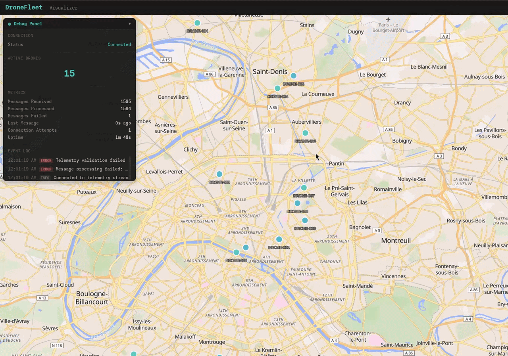
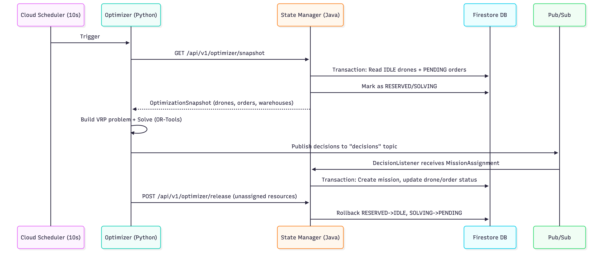

# DroneFleet Optimizer

[](README.md)
[](README.fr.md)

## What's this repo ?

This project is a complete real-time cloud management system for emergency medical delivery drone fleets.

It's based on an event-driven architecture deployed on GCP. With a complete CI/CD deployment, as well as a data Simulator and an ELT pipeline to process and analyse data using BigQuery.

This is a personal project I completed during my final year of computer engineering studies to put into practice all the concepts I learned that I enjoyed the most.

My ultimate goal was to design and implement an end-to-end data infrastructure: from data generation (simulating a live source system) through the ingestion, operational research solving, and real-time flow management, to a medallion architecture for data cleaning, transformation, and analytics.

It also allowed me to deepen my understanding of concepts such as concurrency management, containers, event-driven architecture, monorepo project organization, continuous integration/deployment, and cloud deployment.

You can download it for free by following the [Getting Started](#getting-started) steps, or read on to learn more about how it works and the technical choices made, as well as broader considerations and reflections on the creation and management of such a system.



## Table of Contents

- [Overview](#overview)
- [Architecture](#architecture)
- [Technology Stack](#technology-stack)
- [Getting Started](#getting-started)
- [Data Flow](#data-flow)
  - [Telemetry and Order Ingestion Flow](#telemetry-and-order-ingestion-flow)
  - [Optimization Cycle Flow](#optimization-cycle-flow)
  - [Concurrency and Race Condition Management](#concurrency-and-race-condition-management)
- [Path Optimizer System](#path-optimizer-system)
- [System Components](#system-components)
- [Repository Structure](#repository-structure)
- [Configuration](#configuration)
- [Development](#development)
- [Deployment](#deployment)
- [Testing](#testing)
- [Design Decisions](#design-decisions)
- [Work in Progress](#work-in-progress)
- [License](#license)

## Overview

DroneFleet Optimizer is an autonomous logistics platform capable of delivering emergency medical supplies (blood, vaccines, defibrillators) within 15 minutes in urban areas by coordinating a fleet of drones through a centralized optimization algorithm.

### Business Context

The system addresses critical medical logistics challenges by:

- Optimizing delivery routes for 50-100 simultaneous drones
- Meeting strict SLAs: critical orders delivered within 15 minutes, high priority within 30 minutes
- Handling real-time constraints: battery levels, time windows, warehouse-product compatibility
- Ensuring data consistency and fault tolerance across distributed components

### Key Metrics

- **Latency**: < 500ms for real-time updates
- **Optimization Cycle**: 10-second rolling horizon planning
- **Scale**: 50-100 active drones in MVP phase
- **Reliability**: At-least-once delivery guarantee with no lost orders
- **Cost Optimization**: Firestore batch writes to stay within free tier during development

[↑ Back to Top](#table-of-contents)

## Architecture

The system implements a **polyglot microservices architecture** with hexagonal pattern for infrastructure independence:


### Architectural Principles

- **Event-Driven**: Pub/Sub message bus decouples components
- **Polyglot**: Python (FastAPI), Java (Spring Boot), TypeScript (SolidJS) for optimal tool-task matching
- **Hexagonal Architecture**: Domain logic isolated from infrastructure via ports and adapters
- **Cloud-Native**: Designed for Google Cloud Platform with local emulation support
- **Infrastructure as Code**: Complete Terraform definitions for reproducible deployments

### Environments

```
LOCAL → DEV → PROD
```

- **LOCAL**: Docker Compose with Pub/Sub and Firestore emulators (zero GCP cost)
- **DEV**: Full GCP services with automatic deployment on push to main branch
- **PROD**: Production environment with manual deployment via release tags

## Technology Stack

| Component | Technology | Infrastructure | Purpose |
|-----------|-----------|----------------|---------|
| **Ingestion API** | Python 3.11 / FastAPI | Cloud Run (Service) | Gateway for telemetry and orders, JSON validation, Pub/Sub publishing |
| **Message Bus** | Google Pub/Sub | Pub/Sub / Emulator | Asynchronous event distribution with dead letter queue |
| **State Manager** | Java 21 / Spring Boot 4 | Cloud Run (Service) | State consistency, Firestore transactions, snapshot generation |
| **Optimizer** | Python 3.11 / OR-Tools | Cloud Run (Job) | Vehicle Routing Problem solver with pickup-delivery constraints |
| **Database** | Firestore Native | Firestore / Emulator | Hot storage for real-time state (drones, orders, missions) |
| **Frontend** | TypeScript / SolidJS | Cloud Run (Service) | Real-time map visualization (WebSocket) |
| **Analytics** | BigQuery | BigQuery | Historical data warehouse (work in progress) |

### Shared Model Layer

All components share a single source of truth for data models via **Protocol Buffers**:

- Definitions in `shared/proto/dronefleet/v1/*.proto`
- Generated code for Java, Python, TypeScript
- Validation via Buf (linting, breaking change detection)
- Automated synchronization enforced by pre-commit hooks and CI/CD

[↑ Back to Top](#table-of-contents)

## Getting Started

### Prerequisites

- **Docker** and Docker Compose
- **Mise** (polyglot tool version manager) - [Installation](https://mise.jdx.dev/)
- **uv** (Python package manager) - Installed via mise
- **Buf** (Protobuf tooling) - Installed via mise
- **Java 21** (Temurin distribution)
- **Bun** (TypeScript runtime)

### Local Setup

1. **Clone the repository**

```bash
git clone https://github.com/yourusername/drone-fleet-optimizer.git
cd drone-fleet-optimizer
```

2. **Install tool versions via mise**

```bash
mise install
```

3. **Generate shared models from protobuf definitions**

```bash
mise run //shared/proto:generate
```

4. **Start infrastructure with Docker Compose**

```bash
cd infra/local
docker-compose up -d --build
```

This starts:
- Pub/Sub emulator (port 8085)
- Firestore emulator (port 8080)

5. **Create Pub/Sub topics**

```bash
mise run //infra/local:create-topics
```

6. **Start services (in separate terminals)**

```bash
# Ingestion API
cd services/ingestion
mise run dev

# State Manager
cd services/state_manager
./gradlew bootRun --args='--spring.profiles.active=local'

# Path Optimizer (manual trigger for testing)
cd services/path_optimizer
mise run start

# Simulator
cd services/simulators
mise run dev
```

7. **Verify system is running**

Check Firestore emulator UI: http://localhost:4000
Check Ingestion API docs: http://localhost:8000/docs

[↑ Back to Top](#table-of-contents)

## Data Flow

### Telemetry and Order Ingestion Flow

```
┌─────────────┐
│  Simulator  │ (Generates drone telemetry + delivery orders)
└──────┬──────┘
       │ HTTP POST
       v
┌─────────────────┐
│ Ingestion API   │ (FastAPI - Validation with Pydantic)
│  Cloud Run      │
└────────┬────────┘
         │ Pub/Sub Publish
         ├──────────────────┬──────────────────┐
         v                  v                  v
   [telemetry]        [orders]           [decisions]
         │                  │                  │
         │                  │                  │
         v                  v                  v
┌────────────────────────────────────────────────┐
│         State Manager (Java/Spring Boot)       │
│  - TelemetryListener   - OrderListener         │
│  - DecisionListener    - REST API              │
└───────────────────┬────────────────────────────┘
                    │ Firestore Transactions
                    v
            ┌───────────────┐
            │  Firestore DB │
            │  Collections: │
            │  - drones     │
            │  - orders     │
            │  - missions   │
            │  - warehouses │
            └───────────────┘
```

#### Telemetry Flow Details

1. **Simulator** generates drone position, battery level, status
2. **Ingestion API** validates payload against Pydantic schema
3. **Pub/Sub** delivers message to `telemetry` topic
4. **State Manager** `TelemetryListener` consumes message
5. **Firestore Transaction** updates drone document with:
   - Timestamp ordering (reject out-of-order messages)
   - Position update (GeoPoint)
   - Battery level update
   - Status transition validation

#### Order Flow Details

1. **Simulator** generates delivery request (product type, priority, location)
2. **Ingestion API** validates order payload
3. **Pub/Sub** delivers message to `orders` topic
4. **State Manager** `OrderListener` consumes message
5. **Firestore Transaction** creates/updates order document with:
   - Idempotency guard (prevents overwriting processed orders)
   - Status: `PENDING`
   - Priority-based deadline calculation

### Optimization Cycle Flow

The global logical cycle of the optimization part of the system is represented by :


With more details, the complete flow :
```
┌──────────────────┐
│ Cloud Scheduler  │ (Triggers every 10 seconds)
└────────┬─────────┘
         │ HTTP POST (invoke Cloud Run Job)
         v
┌─────────────────────────────────────────────────┐
│          Path Optimizer (Python/OR-Tools)       │
│                                                 │
│  1. GET /api/v1/optimizer/snapshot              │
│     ├─ Fetch IDLE drones (battery > 20%)       │
│     ├─ Fetch PENDING orders                    │
│     ├─ Fetch warehouses + depot                │
│     └─ Return OptimizationSnapshot             │
│                                                 │
│  2. Build VRP Model (builder.py)                │
│     ├─ Create node graph (depot, pickups,      │
│     │  deliveries)                              │
│     ├─ Compute distance/time matrices          │
│     │  (Haversine)                              │
│     ├─ Map orders to compatible warehouses     │
│     └─ Define time windows per priority        │
│                                                 │
│  3. Solve VRP (solver.py)                       │
│     ├─ Distance dimension (minimize travel)    │
│     ├─ Time dimension (respect deadlines)      │
│     ├─ Battery dimension (consumption model)   │
│     ├─ Pickup-delivery constraints             │
│     └─ Disjunctions (allow dropping infeasible │
│        orders)                                  │
│                                                 │
│  4. Extract Solution (extractor.py)             │
│     ├─ Walk each vehicle route                 │
│     ├─ Classify waypoints (START, PICKUP,      │
│     │  DELIVERY, RETURN)                        │
│     ├─ Compute metrics (battery, duration)     │
│     └─ Build MissionAssignment messages        │
│                                                 │
│  5. Publish Decisions                           │
│     └─ Pub/Sub topic: decisions                │
└─────────────────────────────────────────────────┘
         │
         v
   [decisions] Pub/Sub Topic
         │
         v
┌─────────────────────────────────────────────────┐
│         State Manager - DecisionListener        │
│                                                 │
│  BEGIN Firestore Transaction:                   │
│    1. Read drone (verify IDLE)                  │
│    2. Read all orders (verify PENDING)          │
│    3. Validate via MissionAssignmentPolicy      │
│    4. Create Mission document                   │
│    5. Update drone.status = MOVING              │
│    6. Update orders.status = ASSIGNED           │
│  COMMIT (atomic, all-or-nothing)                │
│                                                 │
│  If validation fails (race condition):          │
│    - Transaction aborted                        │
│    - BusinessRejectionException thrown          │
│    - Affected entities picked up in next cycle  │
└─────────────────────────────────────────────────┘
```

### Concurrency and Race Condition Management

Operating as a distributed system with asynchronous messaging, DroneFleet Optimizer faces inherent concurrency challenges. Multiple components interact simultaneously — the Path Optimizer runs optimization cycles every ~10 seconds, the State Manager processes telemetry, orders, and decisions concurrently, Pub/Sub delivers messages with no ordering guarantees, and Firestore serves as the single source of truth. The system uses **eventual consistency for reads** combined with **strong consistency at write time** to ensure correctness without sacrificing performance.

#### The Core Challenge: Concurrent Optimization Cycles

The primary race condition arises when two optimization cycles overlap and both include the same drone or order in their snapshots:

```
Timeline:
=========

T0: Cycle A starts, calls getSnapshot()
    -> Drone D1 is IDLE -> included in snapshot A

T1: Cycle B starts, calls getSnapshot()
    -> Drone D1 is STILL IDLE -> included in snapshot B
    (A hasn't finished yet, so D1 status unchanged)

T2: Cycle A computes solution -> Assigns D1 to Order O1
T3: Cycle B computes solution -> Assigns D1 to Order O2

T4: Cycle A publishes decision (D1 -> O1)
T5: State Manager processes A's decision
    -> Transaction: D1 is IDLE? YES
    -> SUCCESS: D1.status = MOVING, Mission M1 created

T6: Cycle B publishes decision (D1 -> O2)
T7: State Manager processes B's decision
    -> Transaction: D1 is IDLE? NO (it's MOVING)
    -> REJECTED: BusinessRejectionException thrown
    -> Order O2 remains PENDING for next cycle
```

The system correctly prevents double-assignment through **write-time validation** inside a Firestore transaction.

#### First-Write-Wins Strategy

The conflict resolution model is **first-write-wins**, not first-start-wins. The first transaction to commit wins, regardless of which optimization cycle started first. This is a deliberate design choice:

- **Simpler implementation**: No distributed lock management, no session-based reservation system.
- **No deadlock risk**: Since there is no pessimistic locking, there is no possibility of deadlock.
- **Acceptable waste**: Given that optimization cycles run every ~10 seconds and the solver takes ~8 seconds, overlapping cycles are infrequent. The occasional rejected decision is recovered naturally in the next cycle.

An alternative approach (first-start-wins with pessimistic locking via `RESERVED`/`SOLVING` states) was considered. While it would reduce wasted computation, it introduces significant complexity: distributed lock management, session cleanup for crashed optimizers, and potential deadlocks.

#### Firestore Transaction Pattern: Mission Assignment (Critical Path)

The mission assignment is the most complex transaction in the system. It validates and applies decisions atomically across multiple documents:

```java
firestore.runTransaction(transaction -> {
    // Read all documents FIRST (Firestore requirement)
    DocumentSnapshot droneDoc = transaction.get(droneRef).get();
    List<DocumentSnapshot> orderDocs = /* read all orders */;

    // Convert to domain objects
    Drone drone = FirestoreMapper.toDrone(droneDoc);
    List<Order> orders = /* convert all orders */;

    // Execute business logic (MissionAssignmentPolicy)
    //   - drone.status == IDLE (DronePolicy.canAcceptMission)
    //   - all orders.status == PENDING
    //   - If ANY validation fails -> BusinessRejectionException

    // Write all changes atomically
    transaction.set(missionRef, missionData);       // Create Mission
    transaction.update(droneRef, droneUpdates);      // drone.status = MOVING
    for (Order order : orders) {
        transaction.update(orderRef, orderUpdates);  // order.status = ASSIGNED
    }
    return result;
});
```

**Key properties:**
- All reads happen before any writes (Firestore requirement for optimistic concurrency)
- If any document was modified by another transaction between read and commit, Firestore automatically retries the entire transaction
- Either all writes succeed, or none do (atomicity)
- For multi-order missions, if validation fails for any single order, the entire transaction is rejected — the drone remains IDLE and all orders remain PENDING

#### Optimistic Locking: How Firestore Handles Contention

Firestore implements **optimistic concurrency control** natively. When two transactions attempt to modify the same document concurrently:

1. Transaction A reads drone D1 (status = IDLE), Transaction B reads drone D1 (status = IDLE)
2. Transaction A commits first → SUCCESS: D1.status = MOVING
3. Transaction B attempts to commit
4. Firestore detects that D1 was modified since B's read
5. Firestore **automatically retries** Transaction B from the beginning
6. Transaction B re-reads D1 (now status = MOVING)
7. `MissionAssignmentPolicy` validation fails → `BusinessRejectionException`
8. The rejected decision is logged, and the affected entities are picked up in the next optimization cycle

This is a form of **optimistic locking** — there is no explicit lock acquisition. Instead, conflicts are detected at commit time and resolved by retry. The `MissionAssignmentPolicy` acts as the business-level guard, ensuring that only valid state transitions are committed.

#### Telemetry Ordering Protection

Network conditions can cause telemetry messages to arrive out of order. The State Manager protects against stale data via timestamp comparison:

```java
firestore.runTransaction(transaction -> {
    DocumentSnapshot doc = transaction.get(droneRef).get();
    if (doc.exists()) {
        Instant existingTimestamp = /* get lastUpdate from doc */;
        Instant incomingTimestamp = telemetry.getTimestamp();
        if (incomingTimestamp.isBefore(existingTimestamp)) {
            return null;  // Skip stale telemetry — do not apply older data
        }
    }
    Drone updated = DronePolicy.applyTelemetryUpdate(drone, telemetry);
    transaction.set(droneRef, FirestoreMapper.toMap(updated));
    return updated;
});
```

If a telemetry message T1 (timestamp=10:00:01) arrives after T2 (timestamp=10:00:02), T1 is silently discarded. The drone state always reflects the most recent known data.

#### Order Ingestion Idempotency

Pub/Sub guarantees **at-least-once delivery**, meaning the same order creation message may be delivered multiple times. The order ingestion handler includes an idempotency guard:

```java
firestore.runTransaction(transaction -> {
    DocumentSnapshot doc = transaction.get(orderRef).get();
    if (doc.exists()) {
        OrderStatus currentStatus = /* get status from doc */;
        if (currentStatus != PENDING && currentStatus != UNSPECIFIED) {
            return null;  // Do not overwrite — order already processed
        }
    }
    Order order = /* build order with PENDING status */;
    transaction.set(orderRef, FirestoreMapper.toMap(order));
    return order;
});
```

This prevents a redelivered message from resetting an `ASSIGNED` order back to `PENDING`, which would cause it to be re-assigned and potentially create duplicate missions.

#### Protection Mechanisms Summary

| Mechanism | Location | Protection Provided |
|-----------|----------|---------------------|
| Firestore Transaction | `FirestoreStateTransactionAdapter` | Atomic multi-document writes |
| Optimistic Concurrency | Firestore built-in | Automatic retry on contention |
| Write-time Validation | `MissionAssignmentPolicy` | Status checks before assignment |
| Drone Status Guard | `DronePolicy.canAcceptMission()` | Only IDLE drones can accept missions |
| Order Status Guard | `MissionAssignmentPolicy` | Only PENDING orders can be assigned |
| Timestamp Ordering | `runTelemetryUpdateTransaction` | Reject stale telemetry |
| Idempotency Guard | `runOrderIngestionTransaction` | Prevent resetting processed orders |

#### Known Limitations and Future Improvements

1. **Non-transactional snapshot acquisition**: The snapshot queries for drones and orders are separate, non-transactional reads. State may change between the two queries. This is acceptable because write-time validation catches any inconsistencies, but a future `runSnapshotAcquisitionTransaction()` could atomically read all entities.

2. **Unused session tracking**: The `solvingSessionId` field exists in protobuf definitions but is not yet implemented. It would allow marking entities as RESERVED/SOLVING during optimization, reducing wasted computation from overlapping cycles.

3. **No abandoned session cleanup**: If an optimizer crashes mid-cycle, a TTL-based or heartbeat-based cleanup mechanism would be needed to release reserved entities.

**Correctness guarantee**: No race condition can cause incorrect data (double-assignment, lost orders). The system may waste computation on rejected decisions, but this is an acceptable trade-off for simplicity and reliability.

#### Optimization Algorithm: VRP with Pickup and Delivery

The optimizer solves a **Multi-Trip Vehicle Routing Problem with Time Windows (VRPTW)** using Google OR-Tools:

**Problem Characteristics:**
- **NP-hard** complexity (no polynomial-time optimal solution)
- Heterogeneous fleet (drones with different battery levels)
- Pickup-delivery pairing (warehouse → hospital for each order)
- Time windows (priority-based deadlines)
- Battery constraints (energy consumption model)

**Solution Strategy:**
- **Phase 1**: Constructive heuristic (Parallel Cheapest Insertion) - O(n² × V)
- **Phase 2**: Metaheuristic improvement (Guided Local Search) - 10 seconds time limit
- **Result**: Near-optimal solutions (typically 1-5% from proven optimal)

**Key Constraints:**
- Each order: pickup at compatible warehouse, delivery to hospital, same drone
- Battery: 2.5% consumption per km, minimum 20% reserve upon return
- Time windows: CRITICAL (15 min), HIGH (30 min), STANDARD (60 min)
- Capacity: 1 package at a time (multiple pickup-delivery cycles per mission)

[↑ Back to Top](#table-of-contents)

## Path Optimizer System

The **Path Optimizer** is the core intelligence of DroneFleet Optimizer — a batch optimization service that solves the Vehicle Routing Problem with Pickup and Delivery (VRPPD) for the drone fleet. It is implemented in Python 3.11 and relies on **Google OR-Tools** for the combinatorial optimization core.

### Execution Model

The service runs as a **stateless one-shot process**, triggered on a rolling 10-second schedule via Cloud Run Jobs in production (or as a Docker container locally). Each execution constitutes a single optimization cycle:

1. **Fetch** the current world state (snapshot) from the State Manager via HTTP GET
2. **Build** a mathematical model of the routing problem
3. **Solve** the model under physical and business constraints
4. **Publish** the resulting mission assignments to Pub/Sub

The optimizer reads everything it needs from the State Manager snapshot and produces output exclusively through the Pub/Sub message bus — no direct database access.

```
Ingestion API --> Pub/Sub --> State Manager --> Firestore
                                    |
                          HTTP GET /snapshot
                                    |
                             Path Optimizer
                                    |
                          Pub/Sub (decisions)
                                    |
                             State Manager --> Firestore (missions)
```

### Problem Classification

The problem solved is a **Vehicle Routing Problem with Pickup and Delivery (VRPPD)** — a well-known NP-hard variant of the classical VRP. In our context:

- **Vehicles** are drones, each with heterogeneous battery levels
- **Pickups** happen at warehouses (goods must be collected before delivery)
- **Deliveries** happen at hospitals (final destination for each order)
- Every drone starts and ends at the same **depot**

This is further augmented with:

- **Time windows** on deliveries (priority-based deadlines: CRITICAL 15 min, HIGH 30 min, STANDARD 60 min)
- **Battery constraints** (energy consumption proportional to distance, 2.5% per km, minimum 20% reserve on return)
- **Product-warehouse compatibility** (a warehouse must stock the product type requested by the order)

### VRP Graph Construction

The graph contains `2N + 1` nodes for N orders:

```
Index 0          : Depot (start/end for all vehicles)
Indices 1..N     : Pickup nodes (one per order, at nearest compatible warehouse)
Indices N+1..2N  : Delivery nodes (one per order, at the order's destination)
```

**Critical design decision — unique pickup nodes per order:** Each order gets its own dedicated pickup node, even though multiple orders may be picked up from the same physical warehouse. This is mandatory because OR-Tools `AddPickupAndDelivery(p, d)` requires a strict 1-to-1 relationship between pickup and delivery nodes. Sharing a warehouse node across multiple orders would make the problem infeasible.

For each order, the builder selects the **nearest compatible warehouse** (by Haversine distance to the delivery location). Two `(2N+1) × (2N+1)` matrices are computed:

- **Distance matrix** (meters): pairwise Haversine distances between all node coordinates
- **Time matrix** (seconds): derived from the distance matrix assuming a constant drone cruising speed of 50 km/h

### Solver Dimensions and Constraints

The solver uses OR-Tools' `RoutingModel` API, expressing the problem through **dimensions** (cumulative variables tracked along each route) and **constraints**:

| Dimension | Transit Callback | Upper Bound | Purpose |
|-----------|-----------------|-------------|---------|
| **Distance** | Meters between nodes | 100 km | Minimizes total distance (arc cost evaluator). Global span cost coefficient of 100 encourages even workload distribution across drones. |
| **Time** | Seconds between nodes | 3 hours (10,800s) | Enforces time windows on delivery nodes. Slack up to 30 min allows drones to "wait" at nodes. Start cumul is free (drones can depart at different times). |
| **Battery** | `distance_km × 2.5 × 10` (scaled for integer precision) | 1,000 units (100%) | Per-vehicle cap: `(initial_battery% - 20%) × 10`. Example: drone at 85% battery → max 650 units → 26 km total flight. |

**Pickup-delivery constraints** ensure each order's pickup and delivery are performed by the same drone, in the correct order. **Disjunctions** (penalty: 100,000 per node) allow the solver to gracefully drop infeasible orders rather than making the entire problem unsolvable.

### Algorithm Selection: Two-Phase Approach

Since VRPPD is **NP-hard** (no polynomial-time optimal solution exists), OR-Tools uses a two-phase heuristic/metaheuristic strategy:

#### Phase 1: Constructive Heuristic (PARALLEL_CHEAPEST_INSERTION)

A greedy algorithm that considers all unrouted nodes simultaneously across all vehicles. At each step, it inserts the node that causes the smallest increase in total cost into the best position of any route. Complexity: **O(n² × V)** where n = number of nodes, V = number of vehicles. Completes in milliseconds for typical problem sizes.

#### Phase 2: Metaheuristic Improvement (GUIDED_LOCAL_SEARCH)

An iterative improvement metaheuristic that performs local search moves (relocate, swap, move segments) and escapes local optima by penalizing frequently appearing features. This is an **anytime algorithm**: the longer it runs, the better the solution. Time limit: **30 seconds** (configurable). Each iteration: **O(n²)**.

#### Complexity Comparison

| Approach | Time Complexity | Optimality | Practical Use |
|----------|----------------|------------|---------------|
| Exact (branch-and-bound) | O(n! / symmetries) | Proven optimal | Feasible for n < 20-30 |
| MILP | Exponential worst case | Proven optimal | Feasible for n < 50-100 |
| Nearest neighbor heuristic | O(n²) | 15-25% from optimal | Very fast, poor quality |
| PARALLEL_CHEAPEST_INSERTION | O(n² × V) | 10-20% from optimal | Fast, reasonable quality |
| **GLS metaheuristic (our choice)** | **O(n²) per iteration, time-bounded** | **1-5% from optimal** | **Best balance of speed and quality in our case** |
| Genetic algorithms | O(P × n² × G) | Variable | Slower convergence for VRP |

### Solution Extraction

After solving, the `SolutionExtractor` walks each vehicle's route to build `MissionAssignment` messages:

1. Start at depot, follow the route until return to depot
2. Classify each node: `DEPOT_START`, `WAREHOUSE_PICKUP`, `HOSPITAL_DELIVERY`, `DEPOT_RETURN`
3. Compute aggregate metrics (total distance, time, battery consumption)
4. Skip idle drones (routes with only depot-start and depot-return)

A typical single-order route: `DEPOT_START → WAREHOUSE_PICKUP → HOSPITAL_DELIVERY → DEPOT_RETURN`

A multi-order route alternates pickups and deliveries:
```
DEPOT_START → WAREHOUSE_PICKUP → HOSPITAL_DELIVERY
            → WAREHOUSE_PICKUP → HOSPITAL_DELIVERY
            → DEPOT_RETURN
```

### Data Model

**Input (OptimizationSnapshot):**

| Field | Type | Description |
|-------|------|-------------|
| `session_id` | string | Unique identifier for this optimization cycle |
| `timestamp` | Timestamp | When the snapshot was created |
| `depot` | Depot | Main depot (start/end point for all drones) |
| `drones` | List[Drone] | Available IDLE drones with position, battery, consumption rate |
| `orders` | List[Order] | PENDING delivery orders with location, priority, product type |
| `warehouses` | List[Warehouse] | Pickup locations with authorized product types |

**Output (MissionAssignment):**

| Field | Type | Description |
|-------|------|-------------|
| `drone_id` | string | The assigned drone |
| `order_ids` | List[string] | Orders fulfilled in this mission |
| `route` | List[Waypoint] | Ordered sequence of waypoints with type, position, references |
| `estimated_battery_consumption` | double | Total estimated battery usage (%) |
| `estimated_duration_minutes` | double | Total estimated flight duration |

### Practical Performance

With the current seed data (5 drones, 18 orders, 2 warehouses = 37 nodes), the solver finds a high-quality solution well within the 30-second time limit. The system is designed to scale to the MVP target of 50-100 drones with hundreds of orders by adjusting the time limit and potentially sharding the problem geographically.

[↑ Back to Top](#table-of-contents)

## System Components

### Ingestion API

**Location**: `services/ingestion/`

**Responsibilities:**
- HTTP REST endpoint for telemetry and order ingestion
- Pydantic validation of incoming payloads
- Pub/Sub publishing with error handling
- Health check endpoint

**Technology**: FastAPI (Python 3.11), uvicorn ASGI server

**Key Files:**
- `src/ingestion/api/v1/endpoints/telemetry.py` - Telemetry endpoint
- `src/ingestion/api/v1/endpoints/orders.py` - Orders endpoint
- `src/ingestion/services/` - Business logic and Pub/Sub publishers

### State Manager

**Location**: `services/state_manager/`

**Responsibilities:**
- Consume Pub/Sub events (telemetry, orders, decisions)
- Maintain state consistency via Firestore transactions
- Provide optimization snapshot endpoint
- Implement business policies (drone availability, mission assignment)

**Technology**: Java 21, Spring Boot 4, Google Cloud Firestore SDK

**Architecture**: Hexagonal (Ports and Adapters)
- **Domain Layer**: Business logic and policies
- **Application Layer**: Use cases and DTOs
- **Infrastructure Layer**: Firestore adapters, Pub/Sub listeners, REST controllers

**Key Files:**
- `domain/service/MissionAssignmentPolicy.java` - Mission validation logic
- `domain/service/OptimizationSnapshotService.java` - Snapshot generation
- `infrastructure/adapter/in/messaging/pubsub/` - Event listeners
- `infrastructure/adapter/out/persistence/firestore/` - Database adapters

**Concurrency Handling:**
- Firestore transactions for atomic multi-document writes
- Optimistic locking with automatic retry
- Write-time validation (first-write-wins strategy)
- Timestamp ordering for telemetry
- Idempotency guards for order ingestion

### Path Optimizer

**Location**: `services/path_optimizer/`

**Responsibilities:**
- Fetch optimization snapshot from State Manager
- Build and solve Vehicle Routing Problem
- Publish mission assignments to decisions topic

**Technology**: Python 3.11, Google OR-Tools, Haversine distance calculation

**Key Files:**
- `main.py` - Entry point and orchestration
- `services/builder.py` - VRP model construction
- `services/solver.py` - OR-Tools solver configuration
- `services/extractor.py` - Solution parsing and waypoint classification
- `clients/state_manager.py` - HTTP client for snapshot endpoint
- `clients/publisher.py` - Pub/Sub decision publisher

**Execution Model**: Stateless Cloud Run Job triggered by Cloud Scheduler (10-second interval)

### Simulator

**Location**: `services/simulators/`

**Responsibilities:**
- Generate synthetic telemetry data (drone movements)
- Generate synthetic delivery orders
- Consume mission assignments (work in progress)
- Execute missions by publishing telemetry along route

**Technology**: Python 3.11, asyncio for concurrent drone simulation

**Status**: Telemetry and order generation implemented, mission consumption in progress

### Frontend Visualizer

**Location**: `services/visualizer/`

**Responsibilities:**
- Real-time map display of drone positions
- WebSocket server for live telemetry streaming
- Mission route visualization
- Metrics dashboard (battery levels, active missions)

**Technology**: TypeScript, SolidJS, Vite, Leaflet (map library), Bun runtime

**Status**: Work in progress

[↑ Back to Top](#table-of-contents)

## Repository Structure

### Monorepo Management with Mise

The repository is organized as a **polyglot monorepo** managed with [**mise**](https://mise.jdx.dev/) (formerly "mise en place"). Mise handles:

- **Tool version management**: Python 3.11, Java 21 (Temurin), Node.js, Gradle, Terraform, Buf, and more — all pinned in the root `mise.toml`
- **Environment variables**: Automatic loading of `.env` files from `configs/` based on the `ENVIRONMENT` variable (`local`, `dev`, `prod`)
- **Task orchestration**: Each service and shared module defines its own `mise.toml` with service-specific tasks (build, lint, test, dev), while the root `mise.toml` provides aggregator tasks (`test:all`, `lint:all`, `format:all`)
- **Virtual environment auto-activation**: Python services automatically create and activate `.venv` directories via `uv`

```
mise.toml                          # Root: tool versions, env vars, aggregator tasks
├── services/ingestion/mise.toml   # Python: dev, lint, format, build
├── services/state_manager/mise.toml  # Java: dev, lint, format, build, test
├── services/path_optimizer/mise.toml # Python: start, lint
├── services/simulators/mise.toml  # Python: run, lint
├── services/visualizer/mise.toml  # TypeScript: dev, build
├── shared/proto/mise.toml         # Protobuf: lint, format, generate, breaking
└── infra/local/mise.toml          # Docker Compose: up, down, logs
```

Tasks are invoked using the **monorepo path syntax**:
- Root tasks: `mise run <task>` (e.g., `mise run lint:all`)
- Service tasks: `mise //<path>:<task>` (e.g., `mise //services/ingestion:lint`, `mise //services/state_manager:build`)

### Directory Layout

```
dronefleet-optimizer/
├── services/                    # Microservices (each independently deployable)
│   ├── ingestion/               # Python/FastAPI — HTTP gateway, Pub/Sub publisher
│   ├── state_manager/           # Java/Spring Boot — Event processing, Firestore persistence
│   ├── path_optimizer/          # Python/OR-Tools — VRP solver, batch optimization
│   ├── simulators/              # Python — Synthetic telemetry & order generation
│   └── visualizer/              # TypeScript/SolidJS — Real-time map dashboard
│
├── shared/                      # Cross-service shared definitions
│   ├── proto/                   # Protobuf source of truth (.proto files + Buf config)
│   ├── java/                    # Generated Java models (betterproto/protobuf)
│   ├── python/                  # Generated Python models + shared utilities
│   └── ts/                      # Generated TypeScript models
│
├── libs/                        # Reusable internal libraries
│   ├── python/
│   │   ├── config/              # Shared Python configuration (pydantic-settings)
│   │   ├── logging/             # Structured logging setup (structlog, JSON)
│   │   └── messaging/           # Message publisher abstraction (Factory + Adapter)
│   ├── java/
│   │   ├── config/              # Shared Java configuration
│   │   └── logging/             # Java logging setup (Slf4j, JSON)
│   └── ts/
│       ├── config/              # Shared TypeScript configuration
│       └── logging/             # TypeScript logging setup
│
├── configs/                     # Environment-specific configuration files
│   ├── local.env                # Local dev with emulators (PUBSUB_EMULATOR_HOST, etc.)
│   ├── dev.env                  # GCP dev environment (real Pub/Sub, Firestore)
│   └── prod.env                 # GCP production environment
│
├── infra/
│   ├── local/                   # Docker Compose for local emulators (Pub/Sub, Firestore)
│   └── terraform/               # IaC: modules for Cloud Run, Pub/Sub, Firestore, IAM
│       ├── environments/dev/    # Dev environment Terraform config
│       ├── environments/prod/   # Prod environment Terraform config
│       └── modules/             # Reusable Terraform modules
│
├── tests/                       # Cross-service tests
│   ├── unit/
│   ├── integration/
│   └── e2e/
│
└── docs/                        # Documentation and architecture diagrams
```

### Shared Models via Protocol Buffers + Buf

All data models shared across services are defined as **Protocol Buffers** (`.proto` files) in `shared/proto/dronefleet/v1/`. This is the single source of truth for:

- Drone, Order, Mission, Warehouse entities
- Event messages (telemetry, decisions)
- Enum definitions (DroneStatus, OrderStatus, OrderPriority, WaypointType)

The [**Buf**](https://buf.build/) CLI manages the protobuf workflow:

- **`buf lint`**: Enforces consistent proto style
- **`buf format`**: Auto-formats `.proto` files
- **`buf generate`**: Generates typed code for Java, Python, and TypeScript simultaneously
- **`buf breaking`**: Detects breaking schema changes against the `main` branch (run in CI)

Generated code is placed in `shared/java/`, `shared/python/`, and `shared/ts/`. This approach ensures that:

- All services share an **identical, strongly-typed contract** — no drift between a Python DTO and a Java DTO
- Schema versioning and breaking change detection are automated
- Migration to gRPC or binary serialization is possible in the future with minimal effort

The trade-off is slightly more complex tooling, but the generation and CI checks are fully automated via `mise //shared/proto:generate` and the CI pipeline.

### Messaging Library: Factory + Adapter Pattern

The `libs/python/messaging/` library abstracts the message bus implementation using a **Factory + Adapter** design pattern:

```
libs/python/messaging/src/dronefleet_messaging/
├── base_publisher.py          # Abstract base class (MessagePublisher)
├── factory.py                 # PublisherFactory — selects implementation
└── publisher/
    ├── pubsub_publisher.py    # Google Cloud Pub/Sub adapter
    └── kafka_publisher.py     # Apache Kafka adapter (on-premise option)
```

The `PublisherFactory` reads the `DEPLOYMENT_STRATEGY` environment variable and instantiates the appropriate publisher:

- **`on_cloud`**: Uses `PubSubPublisher` — connects to GCP Pub/Sub (or the Pub/Sub emulator when `PUBSUB_EMULATOR_HOST` is set)
- **`on_premise`**: Uses `KafkaPublisher` — connects to a Kafka cluster (for hypothetical on-premise deployments)

This separation allows the system to run in three modes without any code changes:

| Mode | Strategy | Infrastructure | Use Case |
|------|----------|---------------|----------|
| **Local sandbox** | `on_cloud` | Docker Compose + GCP emulators (Pub/Sub on `localhost:8085`, Firestore on `localhost:8080`) | Day-to-day development, zero cost |
| **GCP Dev/Prod** | `on_cloud` | Real GCP Pub/Sub + Firestore | Deployed environments (`dev.env`, `prod.env`) |
| **On-premise** | `on_premise` | Self-managed Kafka cluster | Hypothetical enterprise deployment |

The environment configuration files in `configs/` are loaded by mise and injected as environment variables. In CI/CD (e.g., `cd-dev.yml`), these same variables are set via the deployment workflow to configure services for the target GCP environment.

[↑ Back to Top](#table-of-contents)

## Configuration

### Environment Variables

Each service reads configuration from environment variables loaded via `.env` files in `configs/`:

- `configs/local.env` - Local development with emulators
- `configs/dev.env` - GCP dev environment
- `configs/prod.env` - GCP production environment

**Key Variables:**

| Variable | Description | Default (local) |
|----------|-------------|-----------------|
| `ENVIRONMENT` | Deployment environment | `local` |
| `PROJECT_ID` | GCP project ID | `local-emulator` |
| `PUBSUB_EMULATOR_HOST` | Pub/Sub emulator address | `localhost:8085` |
| `FIRESTORE_EMULATOR_HOST` | Firestore emulator address | `localhost:8080` |
| `STATE_MANAGER_URL` | State Manager base URL | `http://localhost:8080` |

### Terraform Configuration

Infrastructure is managed via Terraform with separate state per environment:

```
infra/terraform/
├── environments/
│   ├── dev/
│   │   ├── main.tf
│   │   ├── variables.tf
│   │   └── backend.tf
│   └── prod/
│       ├── main.tf
│       ├── variables.tf
│       └── backend.tf
└── modules/
    ├── cloud-run/
    ├── pubsub/
    ├── firestore/
    └── iam/
```

## Development

### Code Quality Standards

The project enforces strict quality standards:

**Python Services:**
- Linting: `ruff` with strict rules
- Type checking: `mypy` in strict mode
- Formatting: `ruff format`
- Testing: `pytest` with coverage requirements

**Java Services:**
- Linting: Checkstyle with Google Java Style
- Formatting: Spotless with automatic fixes
- Testing: JUnit 5

**TypeScript Services:**
- Linting: Biome (ESLint alternative)
- Type checking: TypeScript strict mode
- Formatting: Biome

### Pre-commit Hooks

The repository uses pre-commit hooks to enforce:
- Protobuf model synchronization
- Code formatting
- Linting rules
- Commit message conventions

Install hooks:

```bash
pre-commit install
```

### Testing

**Unit Tests:**

```bash
# Python services
cd services/ingestion
uv run pytest tests/

# Java services
cd services/state_manager
./gradlew test
```

**Integration Tests:**

Located in `tests/integration/` - test complete flows with emulators.

**End-to-End Tests:**

Located in `tests/e2e/` - test full system with simulated drone fleet.

[↑ Back to Top](#table-of-contents)

## Deployment

### CI/CD Pipeline

The project uses GitHub Actions with two workflows:

**1. Continuous Integration (`.github/workflows/ci.yml`)**

Triggered on: Pull requests to main, pushes to main

Steps:
1. Detect changed services via path filters
2. Protobuf validation (lint, breaking changes)
3. Service-specific checks (lint, type check, unit tests)
4. Docker build dry-run
5. Terraform validation

**2. Continuous Deployment (`.github/workflows/cd-dev.yml`)**

Triggered on: Push to main, manual dispatch

Steps:
1. Detect changed services
2. Terraform apply (infrastructure updates)
3. Build and push Docker images to Artifact Registry
4. Deploy services to Cloud Run
5. Deploy Cloud Run Job for optimizer
6. Configure Cloud Scheduler trigger

### Deployment to GCP Dev Environment

```bash
# Authenticate to GCP
gcloud auth login
gcloud config set project drone-fleet-optimizer-dev

# Deploy infrastructure
cd infra/terraform/environments/dev
terraform init
terraform apply

# Deploy services (handled by CI/CD, or manually)
# Build and push images
docker build -t europe-west1-docker.pkg.dev/drone-fleet-optimizer-dev/drone-fleet/ingestion:latest \
  -f services/ingestion/Dockerfile .
docker push europe-west1-docker.pkg.dev/drone-fleet-optimizer-dev/drone-fleet/ingestion:latest

# Deploy to Cloud Run
gcloud run deploy ingestion \
  --image europe-west1-docker.pkg.dev/drone-fleet-optimizer-dev/drone-fleet/ingestion:latest \
  --region europe-west1 \
  --platform managed
```

### Monitoring and Observability

**Logging:**
- Structured JSON logs via `dronefleet_shared.utils.logging_config`
- Google Cloud Logging integration
- Log levels: DEBUG (local), INFO (dev), WARN (prod)

**Metrics:**
- Cloud Run built-in metrics (request count, latency, errors)
- Firestore operation metrics
- Pub/Sub message delivery metrics

**Alerts:**
- Budget alerts configured via Terraform
- Dead Letter Queue monitoring
- High error rate alerts (configured in GCP)

[↑ Back to Top](#table-of-contents)

## Design Decisions

### Why Polyglot Architecture?

I chose **Python for the Ingestion API and Optimizer** because each service had very different technical requirements. FastAPI is genuinely the best choice for high-throughput, asynchronous I/O-bound workloads like validating and routing incoming telemetry. The Ingestion API needs to handle thousands of position updates per second without blocking, and FastAPI + uvicorn delivers that effortlessly. For the Path Optimizer, Google OR-Tools is the de facto standard for routing problems — it's battle-tested, well-documented, and Python bindings are first-class. Rather than fight these ecosystems or try to force everything into one language, I leverage the right tool for each job.

**Java powers the State Manager** because it's where complex, correct business logic lives. The state manager is the heart of the system — it has to enforce invariants around drone status, order transitions, and mission creation atomically. Java's strong typing and compile-time guarantees catch entire categories of bugs before runtime. Spring Boot's transaction management and the Firestore SDK's maturity made it the natural choice for a service that needs to be rock-solid. The hexagonal architecture pattern is also much easier to implement cleanly in Java's ecosystem than elsewhere.

**TypeScript runs the Frontend** because real-time, reactive UI state is a first-class concern. SolidJS offers fine-grained reactivity — only the specific parts of the DOM that change actually re-render, which matters when pushing thousands of position updates per second. The type safety catches UI state bugs early, and modern tooling (Vite, Bun) keeps iteration fast.

The polyglot approach means I'm not forcing artificial abstractions or fighting language constraints. Each service uses its best-suited tool, and the shared Protocol Buffer definitions keep everyone on the same page. It's more operational complexity than a monolith, but it's worth it for the clarity and correctness it buys.

### Why Firestore over PostgreSQL?

I spent time deliberating between Firestore and PostgreSQL, and Firestore won because of the specific problem I'm solving. Drone positions are fundamentally geographic — Firestore's native GeoPoint type means I get geographic queries and distance calculations without manually managing lat/lon columns. Scaling is also beautifully simple: Firestore autoscales horizontally, no capacity planning, no database administration. I can start with the free tier during development (which I do) and scale linearly with usage.

Atomicity is another win. Firestore transactions are optimistic and built into the SDK — I don't need a separate distributed transaction coordinator or saga pattern. The tradeoff is that Firestore's query capabilities are less powerful than SQL (no complex joins, aggregations across millions of documents are expensive). But the State Manager's access patterns are simple: read/write individual documents by ID, or range queries on a few indexed fields. This is exactly where Firestore shines.

The cost argument used to scare me — Firestore charges per read/write operation. But batch writes within a transaction are cheap, and the real-time state is hot (drones, orders, missions), so the data set is compact. During local development with emulators (zero cost), I can iterate freely. Once in production, the operational simplicity of Firestore (no backup management, no replication configuration, no failover) more than compensates for the per-operation cost model.

If I needed complex relational queries (multi-table joins, analytics in the critical path), or if I had millions of historical records that needed to be accessed frequently, I'd reconsider. But for a real-time operational database with simple access patterns, Firestore was the right call.

### Concurrency Model: First-Write-Wins

The concurrency model is where I made a deliberate trade-off between simplicity and computation efficiency. I chose **first-write-wins with optimistic locking**, which means when two optimization cycles compete for the same drone, whoever commits first wins — the second one gets rejected and automatically recovers in the next cycle (10 seconds later).

I considered **pessimistic locking** with `RESERVED` and `SOLVING` states — marking entities as reserved at snapshot time would prevent other cycles from including them. This would eliminate wasted computation. But it introduces complexity: I'd need distributed lock management, session cleanup for crashed optimizers, and careful timeout handling. Plus, there's always the risk of deadlock or leaked locks.

Given that optimization cycles run every 10 seconds and the solver takes about 8 seconds, concurrent cycles are actually rare. When they do happen, a few decisions getting rejected is not a big deal — the entities will be picked up and correctly assigned in the next cycle. The simplicity of optimistic locking (just check status before committing) outweighs the occasional wasted computation. This is a pragmatic choice for an MVP where reliability and simplicity matter more than squeezing every ounce of efficiency.

### Event-Driven vs Request-Response

The system uses a hybrid messaging strategy, and the choice of which to use depends on the access pattern.

**Telemetry and orders flow through Pub/Sub** because they're high-frequency, asynchronous events that don't require synchronous responses. A drone sending its position 5 times per second doesn't care if the State Manager is busy — it just publishes and moves on. Pub/Sub gives me a natural buffer (the topic) and decouples the producer from the consumer. If the State Manager went down for 5 minutes, telemetry would queue up and be processed once it recovered. This async approach scales beautifully.

**The optimization snapshot, however, is synchronous HTTP GET.** The Optimizer needs a consistent point-in-time snapshot of the world — all drones and orders as they exist at this moment. Pub/Sub wouldn't make sense here because there's no "event" per se; it's a query for current state. HTTP GET is simpler, more direct, and it's easy to add timeouts and retry logic. If the State Manager is slow, the Optimizer can fail fast and try again in 10 seconds.

This hybrid approach is intentional: fire-and-forget event streams for state changes, synchronous queries for consistent snapshots. It's the best of both worlds.

[↑ Back to Top](#table-of-contents)

## Work in Progress

### 1. Frontend Visualization (In Development)

**Technology**: SolidJS + Leaflet + WebSocket

**Features**:
- Real-time map with drone positions
- Active mission routes displayed
- Battery levels and drone status indicators
- Order queue visualization
- Metrics dashboard (orders per minute, average delivery time, fleet utilization)

**Architecture**:
- WebSocket server (TypeScript/Bun) subscribes to `telemetry` Pub/Sub topic
- Frontend connects via WebSocket for live updates
- Fallback to HTTP polling for resilience

### 2. BigQuery Analytics Pipeline (Planned)

**Objective**: Historical data warehouse for post-hoc analysis and reporting

**Architecture**:

```
Pub/Sub Topics → BigQuery Subscriptions → BigQuery Tables
  (telemetry)        (streaming insert)       (raw layer)
  (orders)                                        ↓
  (decisions)                                dbt transformations
                                                   ↓
                                            BigQuery Views
                                               (gold layer)
```

**Planned Tables**:

**Raw Layer**:
- `telemetry_raw` - Timestamped drone positions and battery levels
- `orders_raw` - Order creation and status updates
- `decisions_raw` - Mission assignments and rejections

**Gold Layer (dbt models)**:
- `drone_performance` - Metrics per drone (total distance, missions completed, average battery consumption)
- `order_sla_compliance` - Delivery times vs deadlines, priority analysis
- `fleet_utilization` - Idle time, active missions, capacity utilization
- `warehouse_efficiency` - Pickup frequency, average wait time

**Visualization**: Looker Studio dashboards for operational insights

### 3. Simulator Mission Execution (In Development)

**Current State**: Simulator generates telemetry and orders but does not consume missions

**Planned Enhancement**:
- Subscribe to `decisions` Pub/Sub topic
- Parse `MissionAssignment` messages
- Simulate drone movement along assigned route
- Publish telemetry at each waypoint
- Update order status upon delivery completion

**Implementation**: Asyncio-based event loop with concurrent drone agents

[↑ Back to Top](#table-of-contents)

## License

This project is licensed under the MIT License - see the LICENSE file for details.

[↑ Back to Top](#table-of-contents)

---

**Project Status**: Active development. Core optimization engine and state management complete. Frontend visualization and analytics pipeline in progress.

**Contact**: For questions or collaboration opportunities, please open an issue on GitHub.
